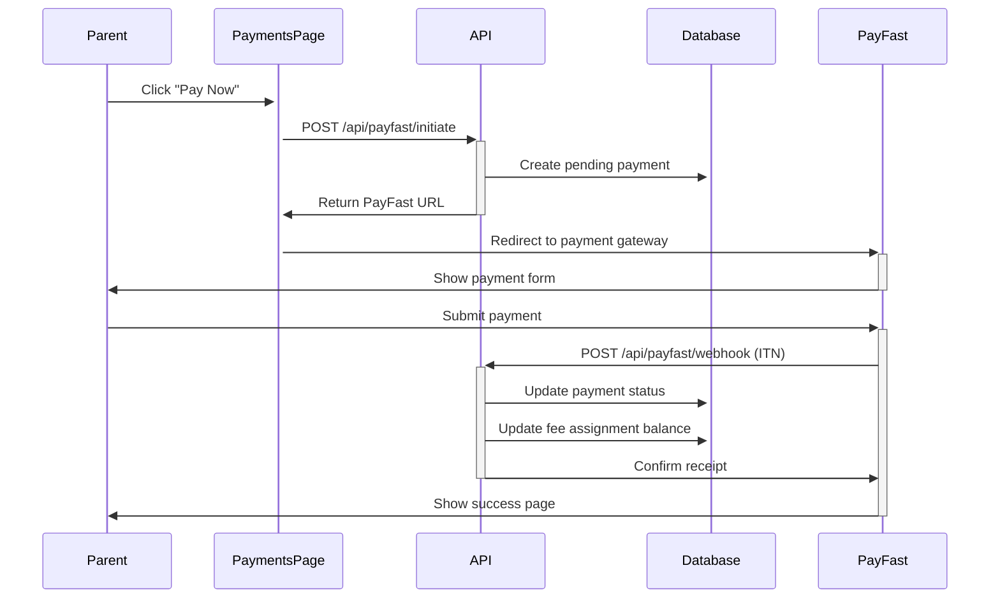

# 💰 Fee Management System - Setup Guide

## 🚀 Overview

The **School Fee Management System** allows principals/admins to configure custom fee structures for their preschools, auto-assign fees to students by age group, and enable parents to pay online via **PayFast** (South African payment gateway).

---

## ✅ What's Implemented

### 1. Database Schema (Migration `07_school_fee_management_system.sql`)

- **`school_fee_structures`**: Master fee configuration per school
  - Supports age groups (0-2, 3-4, 5-6, grade_r, etc.)
  - Multiple billing frequencies (monthly, quarterly, annual, once-off)
  - Fee categories (tuition, registration, transport, meals, etc.)
  - Discounts (sibling, early bird)
  
- **`student_fee_assignments`**: Links fees to specific students
  - Tracks payment status (pending, partial, paid, overdue)
  - Auto-calculates balance
  
- **`fee_payments`**: Individual payment transactions
  - PayFast integration (payment_id, transaction_id)
  - Payment history and receipts

### 2. Principal Dashboard Features

**New Page**: `/dashboard/principal/fees`
- 📊 Financial summary dashboard (collected, outstanding, overdue)
- ➕ Create custom fee structures
- 📋 View all configured fees
- 🗑️ Delete fee structures
- 🏗️ Auto-generate default fee templates

### 3. Parent Payment Features

**Updated Page**: `/dashboard/parent/payments`
- ✅ Real-time fee fetching (no more mock data!)
- 💳 **Pay Now with PayFast** button
- 📤 Upload proof of payment
- 📜 Payment history
- 📋 View fee structure for child's age group

### 4. PayFast Integration (End-to-End)

**API Routes**:
- `/api/payfast/initiate` - Creates payment and redirects to PayFast
- `/api/payfast/webhook` - Receives payment confirmation (ITN)

**Features**:
- ✅ Signature verification
- ✅ Automatic fee assignment updates on successful payment
- ✅ Sandbox mode for testing
- ✅ Custom fields for tracking (assignment ID, student ID)

---

## 🔧 Setup Instructions

### Step 1: Run Database Migration

Run the migration to create the necessary tables:

```bash
# Option 1: Via Supabase Dashboard
# Copy contents of migrations/pending/07_school_fee_management_system.sql
# Paste into Supabase Dashboard > SQL Editor > Run

# Option 2: Via psql
psql -h your-supabase-host -p 6543 -U postgres -d postgres \
  -f migrations/pending/07_school_fee_management_system.sql
```

### Step 2: Configure PayFast Credentials

1. **Get PayFast Account**:
   - Sign up at https://www.payfast.co.za (production)
   - Or use sandbox: https://sandbox.payfast.co.za (testing)

2. **Get Your Credentials**:
   - Merchant ID
   - Merchant Key
   - Passphrase (set in PayFast dashboard)

3. **Add to Environment Variables** (`.env.local`):
   ```bash
   # PayFast Configuration
   PAYFAST_MERCHANT_ID=10000100
   PAYFAST_MERCHANT_KEY=46f0cd694581a
   PAYFAST_PASSPHRASE=your_secure_passphrase_here
   
   # Set to 'true' for sandbox testing
   PAYFAST_SANDBOX=true
   
   # Your application URL
   NEXT_PUBLIC_SITE_URL=http://localhost:3000
   ```

4. **Configure PayFast Webhook**:
   - In PayFast dashboard, set ITN URL to:
     ```
     https://yourdomain.com/api/payfast/webhook
     ```
   - For local testing, use ngrok:
     ```bash
     ngrok http 3000
     # Then set webhook to: https://your-ngrok-url.ngrok.io/api/payfast/webhook
     ```

### Step 3: Create Default Fee Structures

**As Principal**:
1. Navigate to `/dashboard/principal/fees`
2. Click **"Create Defaults"** to generate 4 standard fee structures:
   - Toddlers Monthly Fee (R1,500)
   - Preschool Monthly Fee (R1,200)
   - Grade R Monthly Fee (R1,000)
   - Registration Fee (R500)
3. Edit amounts and details as needed

**Or Create Custom Fees**:
- Click **"Add Fee"** (coming soon - manual form)
- Or insert directly via SQL:

```sql
INSERT INTO school_fee_structures (
  preschool_id,
  name,
  description,
  age_group,
  amount_cents,
  billing_frequency,
  fee_category,
  is_active
) VALUES (
  'your-preschool-id',
  'Toddlers Monthly Fee',
  'Monthly tuition for children aged 0-2 years',
  '0-2',
  150000, -- R1,500.00 in cents
  'monthly',
  'tuition',
  true
);
```

### Step 4: Assign Fees to Students

Fees are **auto-assigned** to students based on their age group:

```sql
-- Manually assign fees to a student
SELECT auto_assign_fees_to_student('student-id-here');

-- Assign fees to all students in a school
SELECT auto_assign_fees_to_student(id)
FROM profiles
WHERE preschool_id = 'your-preschool-id'
  AND role = 'student';
```

**Automatic Assignment**:
- New students automatically get fees assigned when they register
- Based on their `age_group` or `grade_level` field

---

## 🧪 Testing PayFast Integration

### Test in Sandbox Mode

1. **Enable Sandbox**:
   ```bash
   PAYFAST_SANDBOX=true
   ```

2. **Test Payment Flow**:
   - Login as parent
   - Go to `/dashboard/parent/payments`
   - Click **"Pay Now with PayFast"**
   - Use PayFast test cards:
     - **Success**: Card number `4000000000000002`
     - **Failure**: Card number `4000000000000010`

3. **Verify Webhook**:
   - Check console logs for `[PayFast Webhook] Received ITN`
   - Verify payment status updates in `fee_payments` table
   - Check `student_fee_assignments` for balance reduction

### Production Checklist

- [ ] Set `PAYFAST_SANDBOX=false`
- [ ] Update to production merchant credentials
- [ ] Configure production webhook URL in PayFast dashboard
- [ ] Test live payment with small amount (R10)
- [ ] Verify ITN webhook receives notifications
- [ ] Enable SSL/HTTPS (required by PayFast)

---

## 📊 How It Works

### Payment Flow



### Auto-Assignment Logic

1. **On Student Registration**:
   - System checks `profiles.age_group` or `profiles.grade_level`
   - Finds matching `school_fee_structures` for that preschool
   - Creates `student_fee_assignments` entries

2. **On Fee Structure Update**:
   - Principal can activate/deactivate fees
   - Changes only affect future assignments
   - Existing assignments remain unchanged

---

## 🔍 Database Queries

### Get Outstanding Fees for Parent
```sql
SELECT * FROM get_parent_outstanding_fees('parent-user-id');
```

### Get School Financial Summary
```sql
SELECT * FROM get_school_fee_summary('preschool-id');
```

### View Payment History
```sql
SELECT 
  p.first_name || ' ' || p.last_name AS student_name,
  sfs.name AS fee_name,
  fp.amount_cents / 100.0 AS amount,
  fp.payment_date,
  fp.status,
  fp.payfast_transaction_id
FROM fee_payments fp
JOIN student_fee_assignments sfa ON fp.student_fee_assignment_id = sfa.id
JOIN profiles p ON sfa.student_id = p.id
JOIN school_fee_structures sfs ON sfa.fee_structure_id = sfs.id
WHERE sfa.preschool_id = 'your-preschool-id'
ORDER BY fp.payment_date DESC;
```

---

## 🚨 Troubleshooting

### Parents See No Fees

**Check**:
1. Has principal created fee structures?
   ```sql
   SELECT * FROM school_fee_structures WHERE preschool_id = 'your-id';
   ```
2. Are students assigned to fees?
   ```sql
   SELECT * FROM student_fee_assignments WHERE student_id = 'student-id';
   ```
3. Run auto-assignment:
   ```sql
   SELECT auto_assign_fees_to_student('student-id');
   ```

### PayFast Payment Not Processing

**Check**:
1. Environment variables set correctly?
2. Webhook URL accessible (not localhost)?
3. Check API logs for webhook errors
4. Verify signature passphrase matches
5. Ensure ITN is enabled in PayFast dashboard

### Database Permission Errors

**Check RLS policies**:
```sql
-- Allow principals to manage fees
SELECT * FROM pg_policies WHERE tablename = 'school_fee_structures';

-- Allow parents to view their children's fees
SELECT * FROM pg_policies WHERE tablename = 'student_fee_assignments';
```

---

## 🎯 Next Steps

- [ ] Add email notifications for payment confirmations
- [ ] Generate PDF receipts
- [ ] Implement bulk fee assignments
- [ ] Add fee reminders (7 days before due date)
- [ ] Dashboard analytics (collection rate, overdue trends)
- [ ] Multi-child discounts automation
- [ ] SMS payment reminders (Twilio integration)

---

## 📝 API Reference

### POST `/api/payfast/initiate`

**Request**:
```json
{
  "fee_assignment_id": "uuid",
  "amount_cents": 150000,
  "student_id": "uuid",
  "description": "February 2025 Tuition"
}
```

**Response**:
```json
{
  "success": true,
  "payment_url": "https://sandbox.payfast.co.za/eng/process?...",
  "payment_id": "uuid"
}
```

### POST `/api/payfast/webhook`

**PayFast sends form data**:
```
m_payment_id=abc123
pf_payment_id=123456
payment_status=COMPLETE
amount_gross=1500.00
custom_str1=fee-assignment-id
custom_str2=student-id
custom_str3=parent-id
signature=abc123def456
```

**Response**:
```json
{
  "success": true
}
```

---

## 🔒 Security Notes

- ✅ All API routes verify authentication
- ✅ RLS policies prevent unauthorized access
- ✅ PayFast signatures verified on webhook
- ✅ Parent can only pay for their own children
- ✅ Payment amounts validated server-side
- ⚠️ **Never expose merchant keys in client code**
- ⚠️ **Always use HTTPS in production**

---

## 💡 Tips

1. **Test in Sandbox First**: Always test payment flows in sandbox before going live
2. **Monitor Webhooks**: Set up logging/monitoring for webhook failures
3. **Handle Failures Gracefully**: Show clear error messages to parents
4. **Backup Payment Methods**: Allow manual proof of payment upload
5. **Regular Reconciliation**: Compare PayFast transactions with database records

---

**Need Help?** Check PayFast docs: https://developers.payfast.co.za
