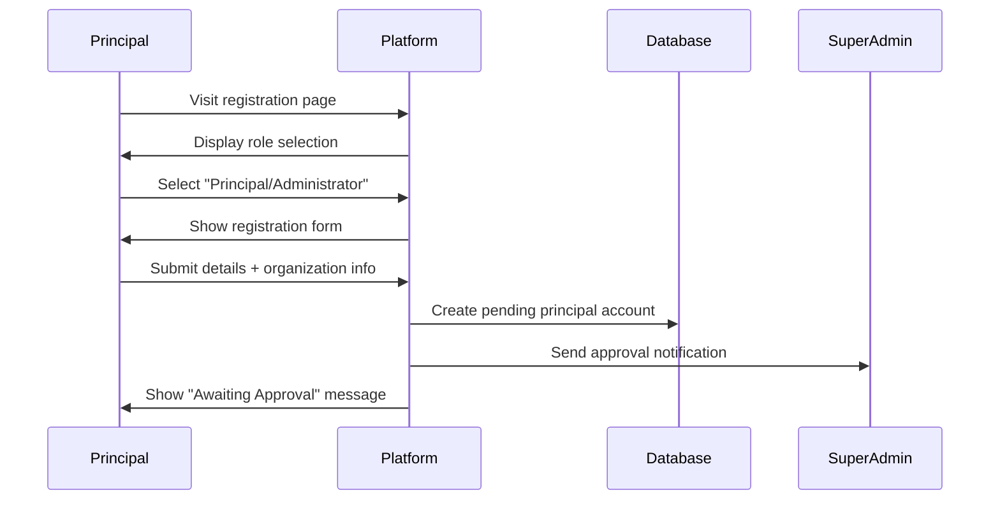
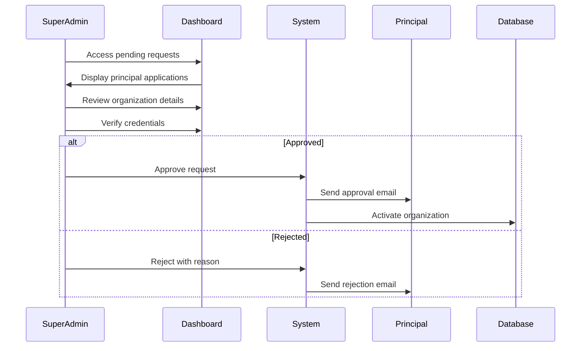
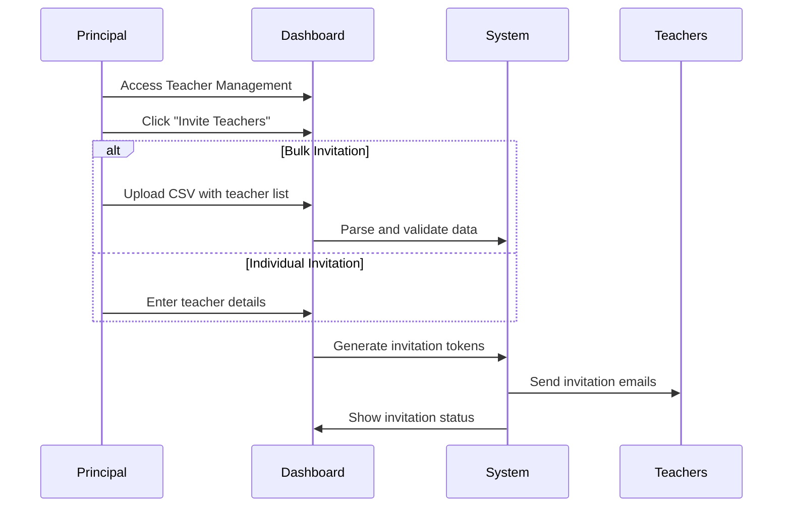
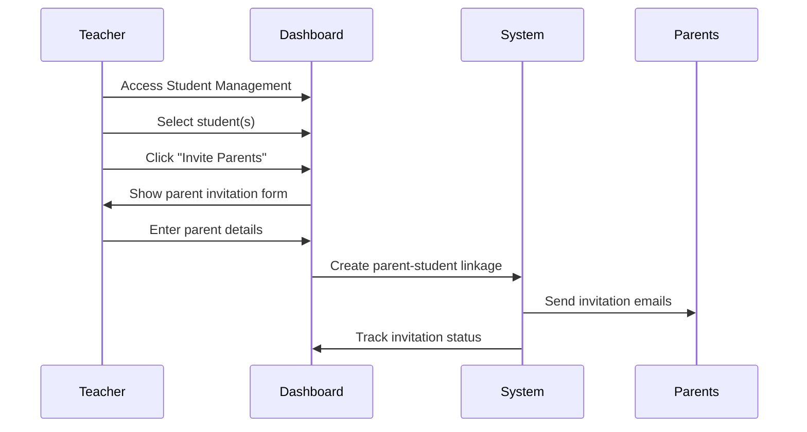

# 🎓 **EduDash Pro Complete Onboarding Flow Documentation**

**Version**: 1.0  
**Date**: 2025-01-21  
**Status**: COMPREHENSIVE SPECIFICATION  

---

## 📋 **Executive Summary**

This document outlines the complete end-to-end onboarding flow for EduDash Pro, covering all user roles from initial Principal request through to automated class allocation and student management. The system supports both preschool (age-based) and K-12 (grade-based) educational institutions.

---

## 🌟 **System Overview**

### **User Hierarchy**

```
┌─────────────────────┐
│    SUPER ADMIN      │ ← Platform administrators
└──────────┬──────────┘
           │ Approves
           ↓
┌─────────────────────┐
│     PRINCIPAL       │ ← Organization creator
└──────────┬──────────┘
           │ Invites
           ↓
┌─────────────────────┐
│     TEACHERS        │ ← Classroom managers
└──────────┬──────────┘
           │ Invites
           ↓
┌─────────────────────┐
│      PARENTS        │ ← Child monitors
└──────────┬──────────┘
           │ Registers
           ↓
┌─────────────────────┐
│     STUDENTS        │ ← Platform users
└─────────────────────┘
```

---

## 🔄 **Complete Onboarding Flow**

### **Phase 1: Principal Onboarding**

#### **1.1 Principal Registration Request**



**Data Collected:**
- Personal Information (Name, Email, Phone)
- Professional Details (Job Title, Years of Experience)
- Organization Information:
  - Name and Type (Preschool/K-12/University)
  - Complete Address
  - Contact Information
  - Student Capacity
  - Academic Calendar

#### **1.2 Super Admin Approval Process**



**Verification Checklist:**
- [ ] Valid educational institution
- [ ] Proper authorization documentation
- [ ] No duplicate organization
- [ ] Valid contact information
- [ ] Acceptable use case

#### **1.3 Organization Setup & Configuration**

Once approved, the Principal completes organization setup:

```typescript
interface OrganizationConfiguration {
  // Basic Settings
  academicYear: {
    start: Date;
    end: Date;
    terms: Term[];
  };
  
  // School Type Configuration
  schoolType: 'preschool' | 'elementary' | 'middle' | 'high' | 'k12' | 'university';
  
  // For Preschools
  preschoolSettings?: {
    ageGroups: [
      { name: 'Infants', minAge: 0.5, maxAge: 1.5 },
      { name: 'Toddlers', minAge: 1.5, maxAge: 3 },
      { name: 'Preschool', minAge: 3, maxAge: 5 },
      { name: 'Pre-K', minAge: 4, maxAge: 6 }
    ];
    classAllocation: 'age_based' | 'manual';
    teacherRatios: {
      infants: 4,    // 1:4 ratio
      toddlers: 6,   // 1:6 ratio
      preschool: 10, // 1:10 ratio
      preK: 12       // 1:12 ratio
    };
  };
  
  // For K-12 Schools
  k12Settings?: {
    gradeSystem: 'us_standard' | 'uk_standard' | 'custom';
    grades: Grade[];
    classAllocation: 'grade_based' | 'performance_based' | 'manual';
    sectionsPerGrade: number;
    studentsPerSection: number;
  };
  
  // Common Settings
  features: {
    parentPortal: boolean;
    studentSelfRegistration: boolean;
    onlineClasses: boolean;
    assignmentSubmission: boolean;
    gradeTracking: boolean;
    attendanceTracking: boolean;
  };
}
```

---

### **Phase 2: Teacher Onboarding**

#### **2.1 Teacher Invitation by Principal**



**Invitation Email Content:**
```
Subject: Invitation to Join [School Name] on EduDash Pro

Dear [Teacher Name],

You have been invited by [Principal Name] to join [School Name] 
as a Teacher on EduDash Pro.

Your invitation details:
- Role: Teacher
- Subjects: [List of Subjects]
- Grade Levels: [List of Grades]
- Invitation Code: [UNIQUE_TOKEN]

Click here to accept invitation: [LINK]
This invitation expires in 7 days.

Best regards,
The EduDash Pro Team
```

#### **2.2 Teacher Registration & Profile Setup**

```typescript
interface TeacherOnboarding {
  step1_acceptance: {
    clickInvitationLink: boolean;
    enterInvitationCode: string;
    validateToken: boolean;
  };
  
  step2_registration: {
    personalInfo: {
      firstName: string;
      lastName: string;
      email: string; // Pre-filled from invitation
      phone: string;
    };
    credentials: {
      password: string;
      confirmPassword: string;
    };
  };
  
  step3_profile: {
    qualifications: string[];
    yearsOfExperience: number;
    subjects: Subject[];
    gradePreferences: Grade[];
    bio: string;
    availability: Schedule;
  };
  
  step4_classAssignment: {
    assignedClasses: Class[];
    schedule: TimeTable;
    studentRosters: Student[][];
  };
}
```

---

### **Phase 3: Parent Onboarding**

#### **3.1 Parent Invitation by Teachers**



#### **3.2 Parent Registration & Child Connection**

```typescript
interface ParentOnboarding {
  step1_invitation: {
    receiveEmail: boolean;
    clickLink: boolean;
    validateConnection: {
      studentName: string;
      studentId: string;
      teacherName: string;
      className: string;
    };
  };
  
  step2_registration: {
    personalInfo: {
      firstName: string;
      lastName: string;
      email: string;
      phone: string;
      relationship: 'mother' | 'father' | 'guardian' | 'other';
    };
    emergencyContact: {
      name: string;
      phone: string;
      relationship: string;
    };
  };
  
  step3_childrenSetup: {
    connectedChildren: Array<{
      studentId: string;
      firstName: string;
      lastName: string;
      grade: string;
      section: string;
      verified: boolean;
    }>;
    additionalChildren: Array<{
      // For siblings not yet in system
      firstName: string;
      lastName: string;
      dateOfBirth: Date;
      grade?: string;
      enrollmentStatus: 'pending' | 'waitlist';
    }>;
  };
  
  step4_preferences: {
    notificationSettings: {
      grades: boolean;
      attendance: boolean;
      assignments: boolean;
      announcements: boolean;
      emergencies: boolean;
    };
    communicationPreference: 'email' | 'sms' | 'app' | 'all';
  };
}
```

---

### **Phase 4: Student Registration & Class Allocation**

#### **4.1 Student Registration Methods**

```typescript
type StudentRegistrationMethod = 
  | 'parent_registration'    // Parent registers child
  | 'self_registration'      // Student self-registers
  | 'school_enrollment'      // School bulk enrollment
  | 'transfer_student';      // Transfer from another school

interface StudentRegistration {
  method: StudentRegistrationMethod;
  
  // Common Information
  studentInfo: {
    firstName: string;
    lastName: string;
    dateOfBirth: Date;
    gender: 'male' | 'female' | 'other';
    email?: string; // Optional for younger students
  };
  
  // Parent/Guardian Info (if not self-registering)
  guardianInfo?: {
    parentId?: string; // If parent already registered
    parentEmail?: string; // For new parent
    relationship: string;
  };
  
  // Academic Information
  academicInfo: {
    previousSchool?: string;
    currentGrade?: string; // For K-12
    currentAge?: number;   // For preschool
    specialNeeds?: string[];
    allergies?: string[];
    medicalConditions?: string[];
  };
}
```

#### **4.2 Automatic Class Allocation**

##### **For Preschools (Age-Based Allocation)**

```typescript
class PreschoolClassAllocator {
  allocateStudent(student: Student, school: PreschoolSettings): ClassAssignment {
    // Step 1: Calculate age in months
    const ageInMonths = this.calculateAgeInMonths(student.dateOfBirth);
    
    // Step 2: Determine age group
    const ageGroup = this.determineAgeGroup(ageInMonths, school.ageGroups);
    
    // Step 3: Find available class in age group
    const availableClasses = this.findClassesForAgeGroup(ageGroup);
    
    // Step 4: Check teacher-student ratios
    const classWithSpace = availableClasses.find(cls => 
      cls.currentStudents.length < school.teacherRatios[ageGroup]
    );
    
    // Step 5: Assign or create new class
    if (classWithSpace) {
      return this.assignToClass(student, classWithSpace);
    } else {
      return this.createNewClass(student, ageGroup);
    }
  }
  
  private determineAgeGroup(ageInMonths: number, ageGroups: AgeGroup[]): string {
    // Age groups with buffer zones for flexibility
    if (ageInMonths >= 6 && ageInMonths < 18) return 'infants';
    if (ageInMonths >= 18 && ageInMonths < 36) return 'toddlers';
    if (ageInMonths >= 36 && ageInMonths < 48) return 'preschool';
    if (ageInMonths >= 48 && ageInMonths < 72) return 'pre-k';
    return 'waitlist'; // Too young or too old
  }
}
```

##### **For K-12 Schools (Grade-Based Allocation)**

```typescript
class K12ClassAllocator {
  allocateStudent(student: Student, school: K12Settings): ClassAssignment {
    // Step 1: Determine grade level
    const grade = this.determineGrade(student);
    
    // Step 2: Find sections for grade
    const sections = this.findSectionsForGrade(grade);
    
    // Step 3: Apply allocation strategy
    switch (school.classAllocation) {
      case 'grade_based':
        return this.allocateByGrade(student, sections);
        
      case 'performance_based':
        return this.allocateByPerformance(student, sections);
        
      case 'manual':
        return this.queueForManualAllocation(student, grade);
        
      default:
        return this.allocateBalanced(student, sections);
    }
  }
  
  private allocateByGrade(student: Student, sections: Section[]): ClassAssignment {
    // Find section with available space
    const availableSection = sections
      .sort((a, b) => a.currentSize - b.currentSize) // Balance sections
      .find(section => section.currentSize < section.maxSize);
    
    if (availableSection) {
      return {
        studentId: student.id,
        sectionId: availableSection.id,
        grade: availableSection.grade,
        academicYear: this.currentAcademicYear(),
        status: 'confirmed'
      };
    }
    
    // Create new section if all full
    return this.createNewSection(student.grade);
  }
  
  private allocateByPerformance(student: Student, sections: Section[]): ClassAssignment {
    // Sections sorted by performance level
    const performanceSections = {
      advanced: sections.filter(s => s.level === 'advanced'),
      regular: sections.filter(s => s.level === 'regular'),
      support: sections.filter(s => s.level === 'support')
    };
    
    // Determine student level based on entrance exam or previous records
    const studentLevel = this.assessStudentLevel(student);
    
    return this.allocateToLeveledSection(student, performanceSections[studentLevel]);
  }
}
```

---

### **Phase 5: Complete System Integration**

#### **5.1 Post-Registration Workflows**

```typescript
interface PostRegistrationWorkflows {
  principal: {
    dashboardAccess: 'immediate',
    features: [
      'organization_overview',
      'teacher_management',
      'student_analytics',
      'financial_reports',
      'academic_calendar',
      'announcement_system'
    ],
    onboardingTasks: [
      'complete_organization_profile',
      'set_academic_calendar',
      'invite_teachers',
      'configure_grade_structure',
      'set_policies'
    ]
  };
  
  teacher: {
    dashboardAccess: 'after_principal_approval',
    features: [
      'class_management',
      'assignment_creation',
      'grade_book',
      'attendance_tracking',
      'parent_communication',
      'lesson_planning'
    ],
    onboardingTasks: [
      'complete_profile',
      'review_assigned_classes',
      'set_office_hours',
      'create_syllabus',
      'invite_parents'
    ]
  };
  
  parent: {
    dashboardAccess: 'immediate',
    features: [
      'child_progress',
      'assignment_tracking',
      'grade_viewing',
      'attendance_monitoring',
      'teacher_messaging',
      'school_announcements'
    ],
    onboardingTasks: [
      'verify_children',
      'set_notification_preferences',
      'emergency_contact_update',
      'consent_forms'
    ]
  };
  
  student: {
    dashboardAccess: 'after_class_assignment',
    features: [
      'view_assignments',
      'submit_homework',
      'check_grades',
      'class_schedule',
      'learning_resources',
      'peer_collaboration'
    ],
    onboardingTasks: [
      'complete_profile',
      'join_assigned_class',
      'review_syllabus',
      'set_study_goals'
    ]
  };
}
```

#### **5.2 Automated Notifications System**

```typescript
class OnboardingNotificationSystem {
  // Principal Notifications
  notifyPrincipalApproval(principal: Principal, organization: Organization) {
    this.sendEmail({
      to: principal.email,
      subject: 'Welcome to EduDash Pro - Your Organization is Approved!',
      template: 'principal_approval',
      data: {
        name: principal.name,
        organization: organization.name,
        nextSteps: [
          'Log in to your dashboard',
          'Complete organization setup',
          'Invite your teachers',
          'Configure academic settings'
        ]
      }
    });
  }
  
  // Teacher Notifications
  notifyTeacherInvitation(teacher: TeacherInvite, principal: Principal) {
    this.sendEmail({
      to: teacher.email,
      subject: `You're invited to join ${principal.organization.name}`,
      template: 'teacher_invitation',
      data: {
        teacherName: teacher.name,
        principalName: principal.name,
        schoolName: principal.organization.name,
        invitationCode: teacher.invitationToken,
        expiryDate: teacher.invitationExpiry
      }
    });
  }
  
  // Parent Notifications
  notifyParentInvitation(parent: ParentInvite, teacher: Teacher, student: Student) {
    this.sendEmail({
      to: parent.email,
      subject: `Connect with ${student.firstName}'s education on EduDash Pro`,
      template: 'parent_invitation',
      data: {
        parentName: parent.name,
        studentName: `${student.firstName} ${student.lastName}`,
        teacherName: teacher.name,
        className: teacher.className,
        schoolName: teacher.organization.name,
        invitationLink: parent.invitationLink
      }
    });
  }
  
  // Student Notifications
  notifyClassAssignment(student: Student, class: Class) {
    if (student.email) {
      this.sendEmail({
        to: student.email,
        subject: `You've been assigned to ${class.name}`,
        template: 'student_class_assignment',
        data: {
          studentName: student.firstName,
          className: class.name,
          teacherName: class.teacher.name,
          schedule: class.schedule,
          firstDay: class.startDate
        }
      });
    }
    
    // Also notify parent
    if (student.parent?.email) {
      this.notifyParentOfAssignment(student.parent, student, class);
    }
  }
}
```

---

## 🔍 **Special Scenarios & Edge Cases**

### **Scenario 1: Mid-Year Student Transfer**

```typescript
interface StudentTransferFlow {
  step1_initiation: {
    initiatedBy: 'parent' | 'previous_school' | 'new_school';
    transferReason: string;
    previousSchoolData: {
      name: string;
      lastGrade: string;
      transcripts: Document[];
      recommendations: Document[];
    };
  };
  
  step2_verification: {
    documentsVerified: boolean;
    academicStanding: 'good' | 'probation' | 'review';
    specialRequirements: string[];
  };
  
  step3_placement: {
    assessmentRequired: boolean;
    assessmentResults?: AssessmentScore;
    recommendedGrade: string;
    recommendedSection: string;
  };
  
  step4_integration: {
    buddyAssigned: boolean;
    orientationScheduled: boolean;
    catchUpPlan?: LearningPlan;
    parentMeeting: boolean;
  };
}
```

### **Scenario 2: Sibling Enrollment**

```typescript
interface SiblingEnrollment {
  existingStudent: {
    id: string;
    name: string;
    grade: string;
    performance: 'excellent' | 'good' | 'average' | 'needs_support';
  };
  
  newSibling: {
    priorityEnrollment: boolean;
    discountApplicable: boolean;
    sameClassPreference: boolean; // For twins
    transportationShared: boolean;
  };
  
  benefits: {
    feeDiscount: number; // Percentage
    priorityPlacement: boolean;
    unifiedParentPortal: boolean;
    consolidatedReporting: boolean;
  };
}
```

### **Scenario 3: Special Needs Students**

```typescript
interface SpecialNeedsOnboarding {
  identification: {
    hasIEP: boolean; // Individualized Education Program
    has504Plan: boolean; // 504 Accommodation Plan
    diagnosedConditions: string[];
    requiredSupport: SupportType[];
  };
  
  accommodations: {
    classroom: string[]; // 'preferential seating', 'quiet space', etc.
    testing: string[]; // 'extended time', 'reader assistance', etc.
    technology: string[]; // 'screen reader', 'speech-to-text', etc.
    behavioral: string[]; // 'movement breaks', 'sensory tools', etc.
  };
  
  teamAssignment: {
    specialEducationTeacher?: Teacher;
    aide?: SupportStaff;
    therapists?: Array<{
      type: 'speech' | 'occupational' | 'physical' | 'behavioral';
      name: string;
      schedule: string;
    }>;
  };
  
  parentCollaboration: {
    regularMeetings: Schedule;
    progressReports: 'weekly' | 'biweekly' | 'monthly';
    homeStrategies: Document[];
  };
}
```

---

## 📊 **Analytics & Monitoring**

### **Onboarding Metrics**

```typescript
interface OnboardingAnalytics {
  principalMetrics: {
    totalRequests: number;
    pendingApprovals: number;
    approvalRate: number;
    averageApprovalTime: Duration;
    organizationTypes: Map<OrganizationType, number>;
  };
  
  teacherMetrics: {
    invitationsSent: number;
    acceptanceRate: number;
    averageTimeToAccept: Duration;
    profileCompletionRate: number;
    subjectDistribution: Map<Subject, number>;
  };
  
  parentMetrics: {
    invitationsSent: number;
    registrationRate: number;
    childrenPerParent: number;
    engagementLevel: 'high' | 'medium' | 'low';
    preferredCommunication: Map<CommunicationType, number>;
  };
  
  studentMetrics: {
    totalEnrolled: number;
    gradeDistribution: Map<Grade, number>;
    ageDistribution: Histogram;
    classAllocationEfficiency: number;
    waitlistCount: number;
  };
  
  systemHealth: {
    onboardingCompletionRate: number;
    averageOnboardingTime: Duration;
    dropOffPoints: Array<{
      step: string;
      dropOffRate: number;
    }>;
    userSatisfactionScore: number;
  };
}
```

---

## 🔒 **Security & Compliance**

### **Data Privacy During Onboarding**

```typescript
interface OnboardingSecurityMeasures {
  dataCollection: {
    minimalDataPrinciple: boolean; // Collect only necessary data
    parentalConsent: boolean; // For students under 13
    gdprCompliant: boolean;
    ferpaCompliant: boolean; // US education privacy law
  };
  
  authentication: {
    invitationTokenExpiry: Duration;
    emailVerification: boolean;
    twoFactorOption: boolean;
    passwordPolicy: PasswordPolicy;
  };
  
  accessControl: {
    roleBasedPermissions: Map<Role, Permission[]>;
    dataVisibility: {
      principals: 'organization_wide';
      teachers: 'class_specific';
      parents: 'child_specific';
      students: 'self_only';
    };
  };
  
  auditTrail: {
    allActionsLogged: boolean;
    invitationTracking: boolean;
    registrationTracking: boolean;
    modificationsTracked: boolean;
  };
}
```

---

## 🚀 **Implementation Timeline**

### **Phased Rollout Strategy**

```typescript
interface RolloutPhases {
  phase1_foundation: {
    duration: '2 weeks',
    tasks: [
      'Super admin dashboard',
      'Principal registration flow',
      'Organization approval system',
      'Basic email notifications'
    ]
  };
  
  phase2_expansion: {
    duration: '3 weeks',
    tasks: [
      'Teacher invitation system',
      'Parent invitation system',
      'Role-based dashboards',
      'Class management basics'
    ]
  };
  
  phase3_automation: {
    duration: '4 weeks',
    tasks: [
      'Automatic class allocation',
      'Age-based grouping (preschool)',
      'Grade-based sections (K-12)',
      'Bulk enrollment tools'
    ]
  };
  
  phase4_enhancement: {
    duration: '3 weeks',
    tasks: [
      'Advanced analytics',
      'Special needs support',
      'Transfer student workflow',
      'API integrations'
    ]
  };
  
  phase5_optimization: {
    duration: 'Ongoing',
    tasks: [
      'Performance tuning',
      'User feedback integration',
      'Feature refinements',
      'Scale testing'
    ]
  };
}
```

---

## 📝 **Best Practices & Recommendations**

### **For Successful Implementation**

1. **Principal Onboarding**
   - Provide comprehensive documentation
   - Offer guided setup wizard
   - Include video tutorials
   - Assign dedicated support for first 30 days

2. **Teacher Adoption**
   - Bulk invitation tools for efficiency
   - Pre-populate common subjects/grades
   - Provide training resources
   - Enable peer mentoring system

3. **Parent Engagement**
   - Simple, mobile-friendly registration
   - Clear value proposition
   - Multiple language support
   - Flexible communication preferences

4. **Student Experience**
   - Age-appropriate interfaces
   - Gamification elements
   - Clear navigation
   - Accessibility features

5. **System Administration**
   - Regular backup of onboarding data
   - Monitor invitation acceptance rates
   - Track user journey analytics
   - Implement feedback loops

---

## 🎯 **Success Metrics**

```typescript
interface OnboardingSuccessMetrics {
  efficiency: {
    target: '90% completion rate',
    measurement: 'Users completing full onboarding / Total users started'
  };
  
  speed: {
    target: 'Average 15 minutes per user',
    measurement: 'Total time from start to dashboard access'
  };
  
  accuracy: {
    target: '95% correct class allocations',
    measurement: 'Correct placements / Total placements'
  };
  
  satisfaction: {
    target: '4.5+ star rating',
    measurement: 'Post-onboarding survey scores'
  };
  
  adoption: {
    target: '80% invitation acceptance',
    measurement: 'Accepted invitations / Total invitations sent'
  };
}
```

---

## 📚 **Appendices**

### **A. Email Templates**
- Principal approval/rejection emails
- Teacher invitation templates
- Parent invitation templates
- Student welcome emails
- Class assignment notifications

### **B. Error Handling**
- Duplicate registration prevention
- Invalid invitation token handling
- Expired invitation management
- Class capacity overflow handling
- Age/grade mismatch resolution

### **C. Integration Points**
- Student Information System (SIS) sync
- Learning Management System (LMS) integration
- Payment gateway connection
- SMS gateway integration
- Video conferencing platform links

---

**End of Onboarding Flow Documentation**

*This living document will be updated as the system evolves and new requirements emerge.*