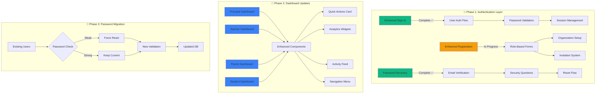
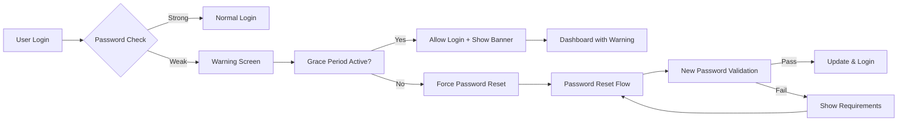

# 🎨 EduDashPro UI/UX Migration & Password Validation Plan

## 📊 Visual Architecture Diagram



## 🎨 Dashboard UI/UX Update Plan

### 📐 **Component Architecture**

```
EduDashPro/
├── components/
│   ├── ui/                     [Shared UI Components]
│   │   ├── EnhancedCard.tsx    ✅ Beautiful cards
│   │   ├── EnhancedInput.tsx   ✅ Form inputs
│   │   ├── EnhancedButton.tsx  🔄 Action buttons
│   │   ├── DataTable.tsx       🔄 Tables
│   │   ├── Charts.tsx          🔄 Analytics
│   │   └── Navigation.tsx      🔄 Menu system
│   │
│   ├── dashboard/              [Dashboard Specific]
│   │   ├── QuickActions.tsx    🔄 Action cards
│   │   ├── StatsWidget.tsx     🔄 Metrics
│   │   ├── ActivityFeed.tsx    🔄 Timeline
│   │   ├── Calendar.tsx        🔄 Schedule
│   │   └── Notifications.tsx   🔄 Alerts
│   │
│   └── auth/                   [Authentication]
│       ├── EnhancedSignIn.tsx  ✅ Complete
│       ├── PasswordRecovery.tsx ✅ Complete
│       └── UserProfile.tsx     ✅ Complete
```

## 🖼️ **Dashboard Visual Layouts**

### **1. Principal Dashboard**
```
┌─────────────────────────────────────────────────┐
│  🏫 School Overview           [User Avatar] ⚙️  │
├─────────────────────────────────────────────────┤
│ ┌─────────┐ ┌─────────┐ ┌─────────┐ ┌─────────┐│
│ │Students │ │Teachers │ │ Classes │ │ Budget  ││
│ │  1,234  │ │   56    │ │   42    │ │ $125K   ││
│ │   +5%   │ │   +2    │ │   +3    │ │  -12%   ││
│ └─────────┘ └─────────┘ └─────────┘ └─────────┘│
│                                                  │
│ ┌───────────────────┐ ┌────────────────────────┐│
│ │  Quick Actions     │ │  Performance Chart     ││
│ │ • Add Teacher      │ │  [📊 Line Graph]       ││
│ │ • Schedule Meeting │ │                        ││
│ │ • View Reports     │ │                        ││
│ │ • Announcements    │ │                        ││
│ └───────────────────┘ └────────────────────────┘│
│                                                  │
│ ┌────────────────────────────────────────────── ┐│
│ │  Recent Activity                              ││
│ │  • New enrollment: John Doe (Grade 5)         ││
│ │  • Teacher leave request: Ms. Smith           ││
│ │  • Budget approval pending                    ││
│ └────────────────────────────────────────────── ┘│
└─────────────────────────────────────────────────┘
```

### **2. Teacher Dashboard**
```
┌─────────────────────────────────────────────────┐
│  👩‍🏫 My Classes              [User Avatar] ⚙️  │
├─────────────────────────────────────────────────┤
│ ┌──────────────────┐ ┌─────────────────────────┐│
│ │ Today's Schedule │ │  Class Performance      ││
│ │ 8:00 - Math 5A   │ │  [📈 Bar Chart]         ││
│ │ 9:00 - Math 5B   │ │                         ││
│ │ 10:00 - Free     │ │  Average: 82%           ││
│ │ 11:00 - Math 6A  │ │                         ││
│ └──────────────────┘ └─────────────────────────┘│
│                                                  │
│ ┌─────────────────────────────────────────────┐ │
│ │  Quick Actions                               │ │
│ │  [Take Attendance] [Grade Work] [Messages]   │ │
│ └─────────────────────────────────────────────┘ │
│                                                  │
│ ┌─────────────────────────────────────────────┐ │
│ │  Pending Tasks                               │ │
│ │  ⚠️ 15 assignments to grade                  │ │
│ │  📅 Parent meeting at 3 PM                   │ │
│ │  📝 Lesson plan due Friday                   │ │
│ └─────────────────────────────────────────────┘ │
└─────────────────────────────────────────────────┘
```

### **3. Parent Dashboard**
```
┌─────────────────────────────────────────────────┐
│  👨‍👩‍👧 My Children            [User Avatar] ⚙️  │
├─────────────────────────────────────────────────┤
│ ┌───────────────┐ ┌─────────────────────────── ┐│
│ │ Sarah - Gr 5  │ │ Academic Progress         ││
│ │ [Photo]       │ │ Math:     ████████░░ 85% ││
│ │ Attendance:95%│ │ Science:  ███████░░░ 78% ││
│ │ Next: Math    │ │ English:  █████████░ 92% ││
│ └───────────────┘ └─────────────────────────── ┘│
│                                                  │
│ ┌─────────────────────────────────────────────┐ │
│ │  Upcoming Events                             │ │
│ │  📅 Parent-Teacher Conference - March 15     │ │
│ │  🎭 School Play - March 22                   │ │
│ │  📚 Book Fair - March 25-27                  │ │
│ └─────────────────────────────────────────────┘ │
│                                                  │
│ ┌─────────────────────────────────────────────┐ │
│ │  Recent Updates                              │ │
│ │  ✅ Math homework submitted                  │ │
│ │  📊 New grade: Science Quiz (B+)            │ │
│ │  💬 Message from Ms. Johnson                 │ │
│ └─────────────────────────────────────────────┘ │
└─────────────────────────────────────────────────┘
```

### **4. Student Dashboard**
```
┌─────────────────────────────────────────────────┐
│  🎒 My Learning              [User Avatar] ⚙️   │
├─────────────────────────────────────────────────┤
│ ┌──────────────┐ ┌──────────────┐ ┌───────────┐│
│ │ Today's      │ │ Homework     │ │ My Grades ││
│ │ Classes      │ │ Due          │ │    85%    ││
│ │ • Math       │ │ • Math p.45  │ │    B+     ││
│ │ • Science    │ │ • Read Ch.3  │ │           ││
│ └──────────────┘ └──────────────┘ └───────────┘│
│                                                  │
│ ┌─────────────────────────────────────────────┐ │
│ │  🎮 Gamification Progress                    │ │
│ │  Level 12 ████████████░░░░ 320/500 XP       │ │
│ │  🏆 Achievements: Math Wizard, Quick Learner │ │
│ └─────────────────────────────────────────────┘ │
│                                                  │
│ ┌─────────────────────────────────────────────┐ │
│ │  Learning Resources                          │ │
│ │  📚 Digital Library  📝 Practice Tests       │ │
│ │  🎥 Video Lessons    💬 Ask Teacher          │ │
│ └─────────────────────────────────────────────┘ │
└─────────────────────────────────────────────────┘
```

## 🔐 **Password Validation Migration Strategy**

### **1. Database Schema Updates**

```sql
-- Add new columns to users table
ALTER TABLE users ADD COLUMN IF NOT EXISTS 
  password_strength VARCHAR(20) DEFAULT 'unknown',
  password_last_changed TIMESTAMP,
  password_must_reset BOOLEAN DEFAULT false,
  password_history JSONB DEFAULT '[]',
  failed_login_attempts INT DEFAULT 0,
  account_locked_until TIMESTAMP;

-- Create password audit table
CREATE TABLE IF NOT EXISTS password_audits (
  id UUID PRIMARY KEY DEFAULT uuid_generate_v4(),
  user_id UUID REFERENCES users(id),
  action VARCHAR(50), -- 'created', 'changed', 'reset', 'failed_validation'
  strength VARCHAR(20),
  ip_address INET,
  user_agent TEXT,
  created_at TIMESTAMP DEFAULT CURRENT_TIMESTAMP
);

-- Create migration tracking
CREATE TABLE IF NOT EXISTS migrations (
  id UUID PRIMARY KEY DEFAULT uuid_generate_v4(),
  name VARCHAR(255) UNIQUE NOT NULL,
  executed_at TIMESTAMP DEFAULT CURRENT_TIMESTAMP
);
```

### **2. Migration Flow for Existing Users**

```typescript
// Migration script: /migrations/password-validation-update.ts

export async function migrateExistingUsers() {
  const steps = [
    // Step 1: Analyze current passwords
    {
      name: 'Analyze Password Strength',
      action: async () => {
        const users = await getAllUsers();
        for (const user of users) {
          const strength = await analyzePasswordStrength(user);
          await updateUserPasswordMetadata(user.id, {
            password_strength: strength,
            password_must_reset: strength === 'weak'
          });
        }
      }
    },
    
    // Step 2: Notify weak passwords
    {
      name: 'Send Reset Notifications',
      action: async () => {
        const weakUsers = await getUsersWithWeakPasswords();
        for (const user of weakUsers) {
          await sendPasswordResetEmail(user, {
            subject: 'Important: Password Security Update Required',
            template: 'password-upgrade-required',
            deadline: '30 days'
          });
        }
      }
    },
    
    // Step 3: Grace period enforcement
    {
      name: 'Setup Grace Period',
      action: async () => {
        await scheduleJob('password-enforcement', {
          runAt: '30 days',
          action: 'force-password-reset-for-weak'
        });
      }
    }
  ];
  
  return executeSteps(steps);
}
```

### **3. User Experience Flow**



### **4. Implementation Timeline**

| Phase | Task | Duration | Status |
|-------|------|----------|--------|
| **Week 1** | Database schema updates | 2 days | 🔄 Ready |
| | Create migration scripts | 1 day | 🔄 Ready |
| | Test in staging | 2 days | ⏳ Pending |
| **Week 2** | Deploy migration | 1 day | ⏳ Pending |
| | Monitor & collect metrics | 3 days | ⏳ Pending |
| | Send notifications | 1 day | ⏳ Pending |
| **Week 3-6** | Grace period | 30 days | ⏳ Pending |
| | Support & monitoring | Ongoing | ⏳ Pending |
| **Week 7** | Enforce new requirements | 1 day | ⏳ Pending |

### **5. Communication Templates**

#### **Email 1: Initial Notice**
```
Subject: Important Security Update for Your EduDashPro Account

Dear [User Name],

As part of our commitment to keeping your data secure, we're 
upgrading our password requirements. 

Your current password needs to be updated to meet our new 
security standards.

What you need to do:
• Click the link below to update your password
• Choose a password that meets our new requirements
• You have 30 days to complete this update

[Update Password Now]

Thank you for helping us keep EduDashPro secure!
```

#### **In-App Banner**
```
⚠️ Password Update Required
Your password doesn't meet our new security requirements. 
Please update it within [X] days to avoid account restrictions.
[Update Now] [Remind Me Later]
```

## 🚀 **Implementation Priority**

1. **Immediate (This Week)**
   - ✅ Enhanced Sign-In (Complete)
   - ✅ Password Recovery (Complete)
   - 🔄 Database schema updates
   - 🔄 Migration scripts

2. **Next Sprint (Week 2-3)**
   - 🔄 Enhanced Registration with validation
   - 🔄 Deploy password migration
   - 🔄 Update Principal Dashboard
   - 🔄 Update Teacher Dashboard

3. **Following Sprint (Week 4-5)**
   - 🔄 Update Parent Dashboard
   - 🔄 Update Student Dashboard
   - 🔄 Analytics integration
   - 🔄 Performance monitoring

4. **Final Phase (Week 6-7)**
   - 🔄 Enforce password requirements
   - 🔄 Complete UI/UX migration
   - 🔄 User feedback integration
   - 🔄 Production deployment

## 📊 **Success Metrics**

```typescript
const successMetrics = {
  passwordSecurity: {
    weakPasswords: '< 5%',        // Target
    averageStrength: '> 80/100',  // Score
    complianceRate: '> 95%'       // Users updated
  },
  uiAdoption: {
    userSatisfaction: '> 4.5/5',  // Rating
    taskCompletion: '< 3 clicks', // Efficiency
    loadTime: '< 2 seconds'        // Performance
  },
  migration: {
    dataIntegrity: '100%',         // No data loss
    userRetention: '> 98%',        // Keep users
    supportTickets: '< 2%'         // Minimize issues
  }
};
```

## 🔄 **Rollback Plan**

In case of issues:
1. **Database**: Restore from pre-migration backup
2. **UI**: Feature flag to toggle old/new interface
3. **Password**: Grace period extension capability
4. **Communication**: Prepared messaging for delays

## ✅ **Next Steps**

1. **Today**: Review and approve migration plan
2. **Tomorrow**: Begin database schema updates
3. **This Week**: Test migration scripts in staging
4. **Next Week**: Start phased rollout to 10% of users
5. **Two Weeks**: Full deployment if metrics are green

---

**This comprehensive plan ensures a smooth transition to the new UI/UX while maintaining security and user experience throughout the migration process.**