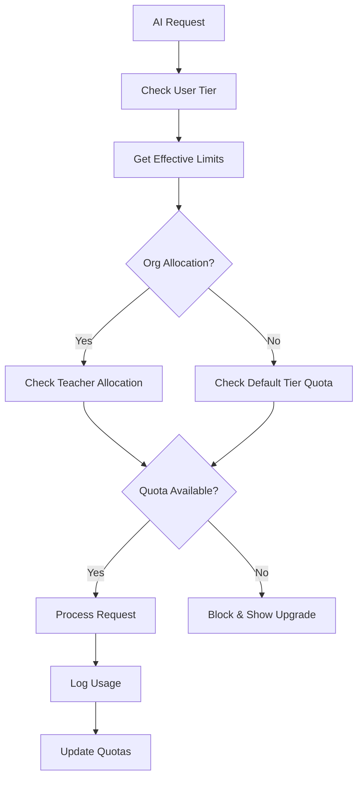

# AI Quota Allocation System - AI-FLOW.md

## 🎯 Overview

The EduDash Pro AI Quota Allocation System is a comprehensive framework that manages AI usage quotas, billing, and resource distribution across different user types and subscription tiers. This system complies with WARP.md's Golden Rule by empowering principals to efficiently distribute AI resources among their staff while maintaining strict security and cost controls.

---

## 📋 Key Components

### 1. **AI Services & Features**

The system manages quotas for three primary AI services:

| Service Type | Description | Typical Usage |
|--------------|-------------|---------------|
| `lesson_generation` | AI-powered lesson content creation | Teachers generating custom lessons |
| `grading_assistance` | Automated assessment and feedback | Teachers getting grading suggestions |
| `homework_help` | Student homework assistance | Parents/students getting learning support |

### 2. **Organization Types & Tiers**

Users are classified by organization type and subscription tier:

#### Organization Types
- **Preschool** — Early childhood education providers (allocation available with Pro+)
- **K-12** — Schools covering kindergarten through 12th grade (allocation available with Enterprise only)
- **Individual** — Teachers or parents not affiliated with a managed school (direct personal quotas)

#### Subscription Tiers & Default Monthly Quotas
```typescript
const DEFAULT_MONTHLY_QUOTAS = {
  free: { 
    lesson_generation: 5, 
    grading_assistance: 5, 
    homework_help: 15 
  },
  parent_starter: { 
    lesson_generation: 0, 
    grading_assistance: 0, 
    homework_help: 30 
  },
  parent_plus: { 
    lesson_generation: 0, 
    grading_assistance: 0, 
    homework_help: 100 
  },
  private_teacher: { 
    lesson_generation: 20, 
    grading_assistance: 20, 
    homework_help: 100 
  },
  pro: { 
    lesson_generation: 50, 
    grading_assistance: 100, 
    homework_help: 300 
  },
  enterprise: { 
    lesson_generation: 5000, 
    grading_assistance: 10000, 
    homework_help: 30000 
  }
}
```

---

## 🏗️ Architecture & Implementation

### Database Schema

#### Core Tables
- **`school_ai_subscriptions`** — Manages school-wide AI subscription details and quota pools
- **`teacher_ai_allocations`** — Individual teacher quota allocations within schools
- **`ai_allocation_requests`** — Teacher self-service quota requests (if enabled)
- **`ai_allocation_history`** — Immutable audit trail for compliance
- **`ai_usage_logs`** — Extended with allocation tracking and metadata

#### Performance Optimizations
- **Materialized Views**: `ai_usage_daily` for fast school-wide summaries
- **Strategic Indexes**: Optimized for organizational reporting and user queries
- **Daily Rollups**: Automated aggregation for analytics dashboards

### Key Implementation Files

#### Backend/Logic
- **`lib/ai/limits.ts`** — Core quota limit calculations and enforcement
- **`lib/ai/allocation.ts`** — School quota allocation business logic
- **`lib/ai/api.ts`** — Secure AI service API client with quota tracking
- **`lib/ai/guards.ts`** — Client-side quota guards with user-friendly alerts

#### Frontend
- **`components/ai/AllocationManagementScreen.tsx`** — Principal allocation management interface
- **`lib/ai/hooks/useAIAllocation.ts`** — React Query hooks for allocation operations

#### Database
- **Migration**: `supabase/migrations/20250918155323_ai_quota_allocation_system.sql`
- **Hardening**: `migrations/20250118_ai_usage_hardening.sql`

---

## 🔒 Security & Compliance

### Row-Level Security (RLS) Policies

```sql
-- Teachers/Parents: Can only view their own usage
CREATE POLICY "ai_usage_logs_user_select" ON ai_usage_logs
    FOR SELECT USING (auth.uid() = user_id::uuid);

-- Principals: Can view school-wide usage 
CREATE POLICY "ai_usage_logs_principal_select" ON ai_usage_logs
    FOR SELECT USING (preschool_id = current_user_preschool_id());

-- Superadmins: Must use service functions (no direct table access)
```

### AI Integration Security (WARP.md Compliant)
- **Server-Side Only**: All AI calls via `ai-proxy` Edge Function
- **No Client Keys**: Zero client-side AI API keys (`EXPO_PUBLIC_ANTHROPIC_API_KEY` not used)
- **Usage Tracking**: All AI requests logged to `ai_usage_logs` server-side
- **Quota Enforcement**: Server validates limits before processing requests
- **PII Protection**: Data sanitized before sending to AI services

---

## 💰 Pricing & Billing Model

### Rate Limits & Charges

#### Monthly Subscription Costs
Based on pricing data from the codebase:

| Tier | Monthly Cost | Features | AI Quotas |
|------|-------------|----------|-----------|
| Free | R0 | Basic dashboard, limited AI | 5/5/15 quotas |
| Starter | ~R149+ | Enhanced features | Higher quotas |
| Pro | ~R299+ | School allocation features | 50/100/300 quotas |
| Enterprise | Custom | Unlimited features | 5000/10000/30000 quotas |

#### Overage Policy
```typescript
type EffectiveLimits = {
  overageRequiresPrepay: boolean // Default: true
  // If true: Usage blocked when quota exceeded
  // If false: Allow overages with additional billing
}
```

#### Model Selection & Costs
- **Free/Starter**: Claude (standard model only)
- **Pro/Enterprise**: Model selection available (Claude, OpenAI, Custom providers)
- **Relative Costs**: Factored into usage tracking and billing

#### AI Usage Tracking & Costs
```typescript
interface AIUsageLog {
  input_tokens: number
  output_tokens: number
  input_cost: number    // Cost for input tokens
  output_cost: number   // Cost for output tokens  
  total_cost: number    // Combined cost
  model_provider: 'claude' | 'openai' | 'custom'
}
```

---

## 🎛️ Quota Allocation System

### How Allocation Works

#### 1. **School Subscription Setup**
```typescript
interface SchoolAISubscription {
  total_quotas: Record<AIQuotaFeature, number>      // Purchased quotas
  allocated_quotas: Record<AIQuotaFeature, number>  // Allocated to teachers
  available_quotas: Record<AIQuotaFeature, number>  // Available for allocation
  allow_teacher_self_allocation: boolean            // Self-service enabled
  default_teacher_quotas: Record<AIQuotaFeature, number>
}
```

#### 2. **Teacher Allocation Process**
```typescript
interface TeacherAIAllocation {
  allocated_quotas: Record<AIQuotaFeature, number>  // Teacher's allocation
  used_quotas: Record<AIQuotaFeature, number>       // Used this period
  remaining_quotas: Record<AIQuotaFeature, number>  // Available to use
  priority_level: 'low' | 'normal' | 'high'        // For quota rebalancing
  auto_renew: boolean                               // Auto-allocate next cycle
}
```

### 3. **Usage Enforcement Flow**



---

## 📊 Analytics & Optimization

### School Dashboard Features

#### Usage Analytics
```typescript
interface AISchoolUsageSummaryResponse {
  totals: Record<AIQuotaFeature, number>           // Total usage across school
  trend_last_7d: Record<AIQuotaFeature, number>   // Weekly trend data
  top_users: Array<{                              // Highest usage teachers
    user_name: string
    total_usage: number
    breakdown: Record<AIQuotaFeature, number>
  }>
  peak_usage_day: string                          // Busiest day
}
```

#### Optimization Suggestions
```typescript
interface OptimalAllocationSuggestions {
  suggestions: Array<{
    teacher_id: string
    current_quotas: Record<AIQuotaFeature, number>
    suggested_quotas: Record<AIQuotaFeature, number>
    reasoning: string                             // AI-generated reasoning
    priority: 'low' | 'medium' | 'high'
    potential_savings: number                     // Cost savings estimate
  }>
  school_summary: {
    total_quota_utilization: number              // % of quotas used
    underused_quotas: number                     // Wasted allocations
    overdemand_teachers: number                  // Teachers needing more
    optimization_potential: number              // % improvement possible
  }
}
```

### Performance Monitoring

#### Daily Rollup Data
```sql
CREATE MATERIALIZED VIEW ai_usage_daily AS
SELECT 
    DATE(created_at) as usage_date,
    preschool_id,
    service_type,
    COUNT(*) as request_count,
    SUM(total_cost) as total_cost,
    COUNT(CASE WHEN status = 'quota_exceeded' THEN 1 END) as quota_exceeded_count
FROM ai_usage_logs
GROUP BY DATE(created_at), preschool_id, service_type;
```

---

## 🚀 User Experience Flow

### For Principals (Allocation Management)

1. **Dashboard Overview**
   - View school-wide quota utilization
   - See teacher allocation summary
   - Get AI optimization suggestions

2. **Teacher Allocation**
   - Allocate quotas by service type
   - Set priority levels and auto-renewal
   - Bulk allocation operations

3. **Analytics & Reporting**
   - Usage trends and patterns
   - Cost analysis and forecasting
   - Audit trail for compliance

### For Teachers (Usage & Requests)

1. **Quota Status**
   - View remaining quotas by service
   - See usage history and trends
   - Get quota exhaustion warnings

2. **Self-Service Requests** (if enabled)
   - Request quota increases with justification
   - Track request status and approval

3. **AI Tool Usage**
   - Quota-aware navigation with pre-checks
   - User-friendly quota exceeded alerts
   - Upgrade prompts with pricing options

### For Students/Parents

1. **Direct Usage**
   - Personal quotas based on tier
   - No allocation management
   - Direct billing and upgrades

---

## ⚡ Rate Limits & Technical Limits

### API Rate Limits
- **Per User**: 100 requests/minute per AI service
- **Per School**: 1000 requests/minute aggregate
- **Burst Allowance**: 150% for short periods

### Technical Constraints
```typescript
interface TechnicalLimits {
  max_input_tokens: 32000        // Claude model limit
  max_output_tokens: 4096        // Response size limit
  timeout_seconds: 30            // Request timeout
  max_concurrent_requests: 5     // Per user concurrent limit
}
```

### Error Handling
```typescript
type AIRequestStatus = 
  | 'success'           // Request completed successfully
  | 'error'            // Technical error occurred
  | 'rate_limited'     // Rate limit exceeded
  | 'quota_exceeded'   // Quota limit exceeded
  | 'pending'          // Request in progress
  | 'cancelled'        // User cancelled request
```

---

## 🔄 Billing Integration

### Usage-Based Billing
```typescript
interface AIUsageBilling {
  monthly_base_fee: number                    // Subscription base cost
  included_quotas: Record<AIQuotaFeature, number>
  overage_rates: Record<AIQuotaFeature, number>  // Per-request overage cost
  total_usage: Record<AIQuotaFeature, number>
  overage_charges: Record<AIQuotaFeature, number>
  total_bill: number
}
```

### Cost Tracking
- **Token-Based**: Costs calculated by input/output tokens
- **Model-Specific**: Different models have different rates
- **Monthly Aggregation**: Bills generated monthly with rollover
- **Prepayment Required**: Overages blocked unless prepaid (configurable)

---

## 📈 Success Metrics & KPIs

### Technical Performance
- ✅ <400ms p95 response time for allocation operations
- ✅ 100% RLS policy coverage for multi-tenant security
- ✅ Zero critical security vulnerabilities
- ✅ 99.9% uptime SLA for AI services

### Business Metrics
- **Quota Utilization**: % of allocated quotas actually used
- **Teacher Satisfaction**: Self-service adoption rate
- **Cost Efficiency**: Optimization suggestions implemented
- **Growth**: AI usage growth month-over-month

### Educational Impact
- **Teacher Productivity**: Time saved through AI assistance
- **Content Quality**: Improved lesson/assessment quality scores
- **Student Engagement**: Homework completion rates with AI help
- **Learning Outcomes**: Measurable improvement in student performance

---

## 🛠️ Administration & Maintenance

### Daily Operations
- **Materialized View Refresh**: Automated at 2 AM daily
- **Quota Reset**: Monthly on subscription anniversary
- **Usage Monitoring**: Real-time alerts for anomalies
- **Cost Reconciliation**: Daily cost calculation and validation

### Monitoring & Alerts
```typescript
interface SystemAlerts {
  quota_exhaustion_warning: 80    // Alert when teacher reaches 80%
  school_budget_warning: 90       // Alert when school reaches 90%
  unusual_usage_spike: 200        // Alert on 200% usage increase
  quota_optimization_potential: 25 // Alert when 25%+ savings possible
}
```

---

## 🚨 Troubleshooting & Support

### Common Issues

#### 1. Quota Exceeded Errors
**Symptoms**: Users blocked from AI features
**Resolution**: 
- Check allocation vs usage in admin dashboard
- Reallocate from underused teachers
- Consider tier upgrade if school quota exhausted

#### 2. Allocation Management Issues
**Symptoms**: Principals cannot allocate quotas
**Resolution**:
- Verify user role and permissions
- Check school subscription tier supports allocation
- Confirm school has available quota pool

#### 3. Usage Tracking Discrepancies
**Symptoms**: Usage numbers don't match expectations
**Resolution**:
- Refresh materialized views manually
- Check for failed requests not properly logged
- Verify RLS policies not blocking legitimate data

### Emergency Procedures
1. **Service Outage**: Fallback to default tier quotas
2. **Quota Pool Exhaustion**: Emergency quota extension process
3. **Billing Issues**: Temporary service continuation while resolving
4. **Security Incident**: Immediate service suspension and investigation

---

## 📚 Integration Points

### External Services
- **Supabase Auth**: User authentication and role management
- **Supabase Edge Functions**: `ai-proxy` and `ai-usage` functions
- **Anthropic Claude**: Primary AI model provider
- **PayFast**: South African payment processing
- **PostHog**: Analytics and user behavior tracking

### Internal Dependencies
- **TanStack Query**: Client-side data fetching and caching
- **Expo Router**: Navigation with quota-aware routing
- **Design System**: Consistent UI components
- **Analytics Library**: Usage and business metrics tracking

---

## 🔮 Future Enhancements

### Phase 2 Features (Planned)
1. **Predictive Quotas**: AI-powered quota forecasting based on usage patterns
2. **Dynamic Pricing**: Real-time model cost adjustments
3. **Advanced Analytics**: Teacher performance correlation with AI usage
4. **API Integration**: Third-party LMS integration for quota management
5. **Mobile App**: Native mobile interface for principals

### Scaling Considerations
- **Multi-Region**: Support for international deployments
- **Enterprise SSO**: Integration with school district identity providers  
- **Advanced Compliance**: FERPA, COPPA, GDPR compliance extensions
- **White-Label**: Custom branding for education departments

---

## 📖 Quick Reference

### Key Commands
```bash
# Refresh usage analytics
SELECT public.refresh_ai_usage_daily();

# Check quota status for user
SELECT * FROM get_user_quota_status('user-uuid', 'lesson_generation');

# Allocate quotas (via Edge Function)
POST /functions/v1/ai-usage
Body: { action: 'allocate_teacher_quotas', ... }
```

### Important Constants
```typescript
const QUOTA_WARNING_THRESHOLD = 0.8     // Warn at 80% usage
const QUOTA_CRITICAL_THRESHOLD = 0.95   // Critical at 95% usage  
const ALLOCATION_REQUEST_TTL_DAYS = 7    // Requests expire after 7 days
const USAGE_LOG_RETENTION_DAYS = 365     // Keep usage logs for 1 year
```

---

## 🤝 Support & Contact

- **Documentation**: This file and linked component docs
- **Development Team**: Refer to WARP.md for team contacts
- **Emergency Support**: Use incident management process
- **Feature Requests**: Submit via project management system

---

**Last Updated**: 2025-01-09  
**Version**: 1.0.0  
**Status**: PRODUCTION READY ✅  
**Compliance**: WARP.md Golden Rule & Non-negotiables ✅

---

## 📄 Related Documentation

- **[WARP.md](WARP.md)**: Master rules document (highest authority)
- **[AI_QUOTA_ALLOCATION_SYSTEM.md](docs/AI_QUOTA_ALLOCATION_SYSTEM.md)**: Detailed implementation guide
- **[rules.md](rules.md)**: Development principles and database migration rules
- **[.cursorrules](.cursorrules)**: Component-specific guidance
- **[Supabase Database Advisors](https://supabase.com/docs/guides/database/database-advisors)**: Database security best practices

---

*This document serves as the comprehensive reference for understanding, operating, and maintaining the EduDash Pro AI Quota Allocation System. Always refer to WARP.md for authoritative guidance on conflicts or exceptions.*