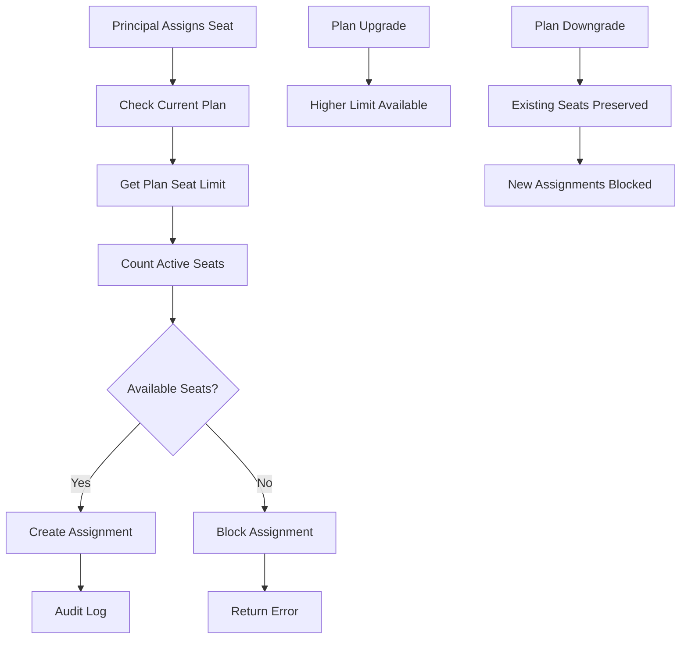
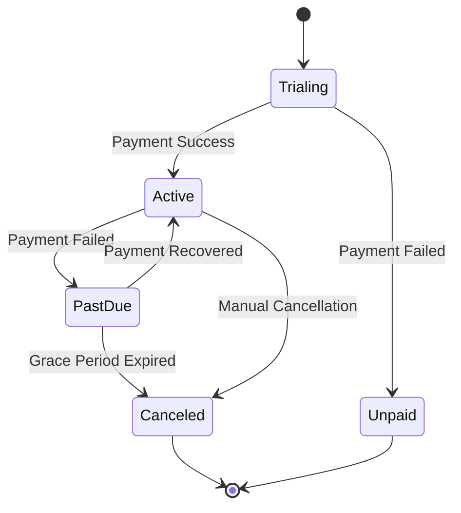

# Billing and Subscription Plans Architecture

## Overview

EduDash Pro implements a multi-tenant subscription billing system with plan-based feature access and teacher seat management. This document outlines the architectural decisions, data models, and business logic governing subscription plans and billing.

## Subscription Model

### Plan Hierarchy

| Plan | Price (ZAR) | Teacher Seats | Features | Target Market |
|------|-------------|---------------|----------|---------------|
| **Free** | R0/month | 1 | Basic dashboard, limited AI | Trial users |
| **Starter** | R299/month | 5 | Full dashboard, standard AI | Small preschools |
| **Premium** | R599/month | 15 | Advanced features, priority AI | Medium preschools |
| **Enterprise** | Custom | 100 | White-label, custom integrations | Large organizations |

### Data Model

#### Subscription Plans Table
```sql
CREATE TABLE public.subscription_plans (
  id uuid PRIMARY KEY DEFAULT gen_random_uuid(),
  name text UNIQUE NOT NULL,
  display_name text NOT NULL,
  description text,
  price_monthly integer, -- in cents (ZAR)
  price_annual integer,  -- in cents (ZAR)
  teacher_seat_limit integer NULL, -- NULL = unlimited
  features jsonb,
  is_active boolean DEFAULT true,
  created_at timestamptz DEFAULT now(),
  updated_at timestamptz DEFAULT now()
);

-- Constraints
ALTER TABLE public.subscription_plans
ADD CONSTRAINT plans_teacher_seat_limit_non_negative
CHECK (teacher_seat_limit IS NULL OR teacher_seat_limit >= 0);
```

#### Subscriptions Table
```sql
CREATE TABLE public.subscriptions (
  id uuid PRIMARY KEY DEFAULT gen_random_uuid(),
  preschool_id uuid REFERENCES public.preschools(id) ON DELETE CASCADE,
  plan_id uuid REFERENCES public.subscription_plans(id),
  status subscription_status NOT NULL,
  billing_cycle billing_cycle_type DEFAULT 'monthly',
  starts_at timestamptz NOT NULL,
  ends_at timestamptz,
  trial_ends_at timestamptz,
  canceled_at timestamptz,
  metadata jsonb,
  created_at timestamptz DEFAULT now(),
  updated_at timestamptz DEFAULT now()
);

-- Enums
CREATE TYPE subscription_status AS ENUM (
  'trialing',
  'active', 
  'past_due',
  'canceled',
  'unpaid'
);

CREATE TYPE billing_cycle_type AS ENUM (
  'monthly',
  'annual'
);
```

## Teacher Seat Management

### Architecture Principles

1. **Plan-Based Limits**: Teacher seat limits are stored in `subscription_plans.teacher_seat_limit`
2. **Source of Truth**: Plan table is the single source of truth for seat enforcement
3. **Soft Enforcement**: Existing assignments are preserved when limits are reduced
4. **Audit Trail**: Full tracking of seat assignments and revocations

### Seat Assignment Flow



### Data Model

#### Teacher Seats Table
```sql
CREATE TABLE public.subscription_seats (
  id uuid PRIMARY KEY DEFAULT gen_random_uuid(),
  preschool_id uuid NOT NULL REFERENCES public.preschools(id) ON DELETE CASCADE,
  teacher_user_id uuid NOT NULL REFERENCES public.profiles(id) ON DELETE CASCADE,
  assigned_by uuid REFERENCES public.profiles(id) ON DELETE SET NULL,
  assigned_at timestamptz DEFAULT now(),
  revoked_at timestamptz NULL,
  revoked_by uuid REFERENCES public.profiles(id) ON DELETE SET NULL,
  is_active boolean GENERATED ALWAYS AS (revoked_at IS NULL) STORED,
  
  -- Constraints
  CONSTRAINT unique_active_seat_per_teacher
    UNIQUE (preschool_id, teacher_user_id, revoked_at)
    DEFERRABLE INITIALLY IMMEDIATE
);

-- Indexes
CREATE INDEX idx_subscription_seats_active 
ON public.subscription_seats(preschool_id) 
WHERE revoked_at IS NULL;

CREATE INDEX idx_subscription_seats_teacher 
ON public.subscription_seats(teacher_user_id);
```

## Business Logic Implementation

### Plan Limit Enforcement

The system enforces teacher seat limits through several layers:

1. **Database RPCs**: Atomic limit checking with advisory locks
2. **Application Logic**: UI shows usage and blocks assignment buttons
3. **Business Rules**: Soft limits preserve existing assignments

#### Core RPC: Seat Assignment
```sql
CREATE OR REPLACE FUNCTION public.rpc_assign_teacher_seat(target_user_id uuid)
RETURNS jsonb
LANGUAGE plpgsql
SECURITY DEFINER
AS $$
DECLARE
  v_limit int;
  v_used int;
  v_school uuid;
BEGIN
  -- Get current plan limit
  SELECT sp.teacher_seat_limit INTO v_limit
  FROM public.subscriptions s
  JOIN public.subscription_plans sp ON sp.id = s.plan_id
  WHERE s.preschool_id = v_school
    AND s.status IN ('active','trialing')
  ORDER BY s.created_at DESC
  LIMIT 1;

  -- Count active seats  
  SELECT count(*) INTO v_used
  FROM public.subscription_seats
  WHERE preschool_id = v_school AND revoked_at IS NULL;

  -- Enforce limit (NULL = unlimited)
  IF v_limit IS NOT NULL AND v_used >= v_limit THEN
    RAISE EXCEPTION 'No teacher seats available for this plan';
  END IF;

  -- Create assignment
  INSERT INTO public.subscription_seats (preschool_id, teacher_user_id, assigned_by)
  VALUES (v_school, target_user_id, auth.uid());

  RETURN jsonb_build_object('status', 'assigned');
END;
$$;
```

### Plan Change Behavior

#### Upgrade Scenarios
- **Immediate Effect**: New seat limit available immediately
- **Retroactive Access**: Previously blocked teachers can be assigned
- **No Data Loss**: All existing assignments preserved

#### Downgrade Scenarios  
- **Soft Enforcement**: Existing seats remain active (over-capacity state)
- **New Assignment Block**: Cannot assign new seats until under limit
- **Grace Period**: Schools receive notification of over-capacity status

### Billing Integration

#### Payment Providers
- **PayFast**: Primary payment gateway for South African market
- **Webhooks**: Real-time subscription status updates
- **Retry Logic**: Automatic retry for failed payments

#### Subscription Lifecycle


## Feature Access Control

### Feature Gates

Features are controlled through a combination of:
1. **Plan Features**: Stored in `subscription_plans.features` JSONB
2. **Seat Requirements**: Some features require active teacher seat
3. **Usage Limits**: AI calls, storage, API requests

#### Feature Configuration Example
```json
{
  "ai": {
    "enabled": true,
    "monthly_quota": 1000,
    "models": ["claude-3-haiku", "claude-3-sonnet"]
  },
  "integrations": {
    "whatsapp": true,
    "email": true,
    "sms": false
  },
  "storage": {
    "limit_gb": 10,
    "retention_days": 365
  },
  "support": {
    "priority": "standard",
    "channels": ["email"]
  }
}
```

### Access Check Implementation

```typescript
// Feature access service
export class FeatureAccessService {
  static async hasFeatureAccess(
    preschoolId: string, 
    featurePath: string
  ): Promise<boolean> {
    const subscription = await this.getCurrentSubscription(preschoolId);
    if (!subscription) return false;

    const features = subscription.plan.features;
    return this.checkFeaturePath(features, featurePath);
  }

  static async getTeacherSeatUsage(preschoolId: string) {
    const { data } = await supabase.rpc('rpc_teacher_seat_limits');
    return data;
  }
}
```

## Security Model

### Multi-Tenant Isolation
- **Plan Access**: Schools can only view their own subscription details
- **Seat Management**: Principals can only assign seats to teachers in their school
- **Billing Data**: Payment information isolated per tenant

### Row-Level Security
```sql
-- Subscription access policy
CREATE POLICY subscription_select_policy
ON public.subscriptions
FOR SELECT
USING (
  EXISTS (
    SELECT 1 FROM public.profiles p
    WHERE p.id = auth.uid()
      AND p.preschool_id = subscriptions.preschool_id
      AND p.role IN ('principal', 'admin')
  )
);

-- Seat management policy  
CREATE POLICY subscription_seats_select_principal
ON public.subscription_seats
FOR SELECT
USING (
  EXISTS (
    SELECT 1 FROM public.profiles p
    WHERE p.id = auth.uid()
      AND p.preschool_id = subscription_seats.preschool_id
      AND p.role = 'principal'
  )
  OR
  subscription_seats.teacher_user_id = auth.uid()
);
```

## Performance Considerations

### Query Optimization
- **Plan Lookups**: Cached frequently accessed plan data
- **Seat Counting**: Partial indexes on active seats
- **Feature Checks**: Memoized feature access results

### Caching Strategy
```typescript
// TanStack Query configuration
export const subscriptionQueries = {
  current: (preschoolId: string) => ({
    queryKey: ['subscription', preschoolId],
    queryFn: () => SubscriptionService.getCurrent(preschoolId),
    staleTime: 5 * 60 * 1000, // 5 minutes
  }),
  
  seatUsage: (preschoolId: string) => ({
    queryKey: ['seat-usage', preschoolId],
    queryFn: () => SeatService.getUsage(preschoolId),
    staleTime: 30 * 1000, // 30 seconds
  }),
};
```

### Concurrency Control
- **Advisory Locks**: Prevent race conditions during seat assignment
- **Atomic Operations**: Seat limit checking and creation in single transaction
- **Optimistic Updates**: UI updates immediately with rollback on error

## Monitoring & Analytics

### Key Metrics
- **Subscription Health**: Churn rate, upgrade/downgrade rates
- **Seat Utilization**: Usage vs. limits across plans
- **Feature Adoption**: Which features drive plan upgrades
- **Payment Success**: Success rates by payment method

### Alerts & Notifications
- **Over-Capacity**: When schools exceed seat limits
- **Payment Failures**: Failed payment attempts
- **Plan Changes**: Upgrade/downgrade notifications
- **Usage Thresholds**: Feature limit warnings

## Migration & Rollback

### Plan Changes
- **Backward Compatibility**: Old plan structures supported during migration
- **Data Preservation**: No data loss during plan updates
- **Rollback Path**: Ability to revert plan changes if needed

### Seat Limit Updates
- **Product Approval**: All limit changes require product team approval
- **Migration Script**: Automated application of new limits
- **Monitoring**: Track impact of limit changes on user behavior

## API Design

### GraphQL Schema
```graphql
type Subscription {
  id: ID!
  plan: SubscriptionPlan!
  status: SubscriptionStatus!
  billingCycle: BillingCycle!
  startsAt: DateTime!
  endsAt: DateTime
  trialEndsAt: DateTime
  teacherSeats: TeacherSeatConnection!
}

type SubscriptionPlan {
  id: ID!
  name: String!
  displayName: String!
  teacherSeatLimit: Int # null = unlimited
  features: JSON!
  pricing: PlanPricing!
}

type TeacherSeatUsage {
  limit: Int # null = unlimited  
  used: Int!
  available: Int # null = unlimited
  isOverCapacity: Boolean!
}
```

### REST Endpoints
```
GET    /api/v1/subscriptions/current
POST   /api/v1/subscriptions/upgrade
DELETE /api/v1/subscriptions/cancel

GET    /api/v1/seats/usage
POST   /api/v1/seats/assign
DELETE /api/v1/seats/{seatId}/revoke

GET    /api/v1/plans
GET    /api/v1/plans/{planId}/features
```

## Compliance & Legal

### Data Privacy
- **PII Handling**: Minimal collection, secure storage
- **Data Retention**: Configurable retention policies per plan
- **Data Export**: Self-service data export for customers

### Financial Compliance
- **Tax Handling**: South African VAT calculation
- **Receipt Generation**: Automated invoice and receipt generation
- **Audit Trail**: Complete payment and subscription history

### Terms of Service
- **Plan Limitations**: Clear communication of seat limits
- **Fair Usage**: AI and API usage policies
- **Cancellation**: Clear cancellation terms and data retention

## Future Enhancements

### Roadmap Items
1. **Usage-Based Billing**: Per-student or per-API-call pricing tiers
2. **Custom Plans**: Enterprise-specific plan configuration
3. **Seat Pools**: Shared seat pools across multiple schools
4. **Advanced Analytics**: Predictive churn and upgrade modeling

### Technical Debt
- **Legacy Plan Migration**: Consolidate historical plan structures
- **Performance Optimization**: Further query optimization for large tenants
- **Mobile Billing**: In-app purchase integration for mobile apps

## References

- [Security Model](/docs/security/seats.md)
- [Database Changes](/docs/database/changes/2025-09-seats.md)
- [WARP.md Billing Guidelines](/docs/governance/WARP.md#billing-architecture)
- [Payment Integration Documentation](/docs/integrations/payments.md)

---

**Document Maintained By**: Engineering Team  
**Last Updated**: September 2025  
**Review Cycle**: Quarterly