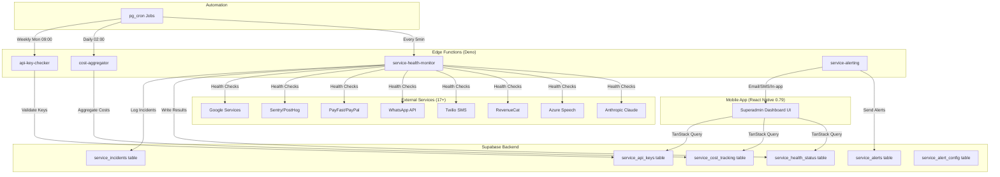

# Service Monitoring System - Agent3 Task Plan

**Owner**: Agent3  
**Target Timeline**: 15 days  
**Status**: Planning Phase  
**Last Updated**: 2025-10-21

---

## Executive Summary

This document defines the complete implementation plan for the **Service Monitoring System** that enables superadmins to track the health, usage, cost, and status of all 17+ external services used by EduDash Pro. The system prevents app crashes by providing real-time monitoring and proactive alerts.

**Key Objectives**:
1. Monitor health of all external APIs (Anthropic, Azure Speech, Supabase, payments, communication)
2. Track usage and costs per preschool/service for accurate billing
3. Manage API key expiration and renewal
4. Alert superadmins of critical service failures
5. Provide actionable insights for cost optimization

---

## Architecture Overview



---

## External Services Inventory

### Critical Infrastructure (App-breaking if down)
1. **Supabase** - Database, Auth, Storage, Edge Functions
2. **Anthropic Claude** - AI chat/completion (claude-3-5-sonnet, claude-3-haiku)
3. **Microsoft Azure Speech** - STT/TTS for 5 SA languages

### Payment & Monetization
4. **RevenueCat** - In-app subscription management
5. **Google AdMob** - Ad serving (free tier)
6. **PayFast** - SA payment gateway
7. **PayPal** - International payments

### Communication
8. **Twilio** - SMS messaging
9. **WhatsApp Cloud API (Meta)** - Business messaging
10. **Google Calendar API** - OAuth calendar sync

### AI & Voice (Secondary)
11. **OpenAI** - Alternative/fallback AI + Whisper transcription
12. **Deepgram** - Language detection fallback
13. **Google Cloud TTS** - TTS fallback

### Monitoring & Analytics
14. **Sentry** - Error tracking
15. **PostHog** - Product analytics

### Development & Build
16. **Expo (EAS)** - Updates, push notifications, builds
17. **Picovoice** - Wake word detection (optional)

---

## Task Breakdown (18 Tasks)

### Phase 0: Discovery (Days 1-2)

#### Task 1: Repository-wide External Services Discovery
**Deliverables**:
- `docs/features/service-monitoring/EXTERNAL_SERVICES_INVENTORY.md`
- `scripts/scan-external-services.mjs`

**Commands** (read-only):
```bash
# Dependencies scan
jq '.dependencies, .devDependencies' package.json | grep -E "(anthropic|openai|azure|twilio|whatsapp|revenuecat|admob|payfast|paypal|sentry|posthog|deepgram|picovoice)"

# API endpoint detection
rg -n "https?://[a-zA-Z0-9\.\-_/]+" --glob "!**/node_modules/**" -g "*.ts" -g "*.tsx" -g "*.js"

# Environment variable usage
rg -n "(ANTHROPIC_|AZURE_|TWILIO_|OPENAI_|DEEPGRAM_|REVENUECAT_|ADMOB_|PAYFAST_|PAYPAL_|SENTRY_|POSTHOG_|WHATSAPP_|GOOGLE_|PICOVOICE_|EXPO_)" --glob "!**/node_modules/**" .env* app supabase services lib

# Edge Function analysis
ls -la supabase/functions/
rg -n "Deno\.fetch|net\.http_(get|post)" supabase/functions/
```

**Output Format** (per service):
```markdown
## [Service Name]
- **Category**: infrastructure|ai|voice|payment|communication|monitoring
- **Criticality**: critical|high|medium|low
- **API Domains**: [list of endpoints]
- **SDK/Package**: [npm package name + version]
- **Environment Variables**: [list]
- **Usage Locations**: [file paths]
- **Cost Model**: [free|pay-per-use|subscription]
- **Official Docs**: [link]
```

#### Task 2: Baseline Inventory Validation
Cross-reference discovery output against initial 17-service list. Flag any missing or additional services.

---

### Phase 1: Database Foundation (Days 1-2)

#### Task 3: Database Migration Creation

**File**: `supabase/migrations/20251022000000_service_monitoring_system.sql`

**Schema**:

```sql
-- Enable required extensions
CREATE EXTENSION IF NOT EXISTS "uuid-ossp";
CREATE EXTENSION IF NOT EXISTS "pg_cron";

-- Service health status tracking
CREATE TABLE IF NOT EXISTS service_health_status (
  id UUID PRIMARY KEY DEFAULT uuid_generate_v4(),
  service_name TEXT NOT NULL UNIQUE,
  service_category TEXT NOT NULL CHECK (service_category IN ('infrastructure', 'ai', 'voice', 'payment', 'communication', 'monitoring', 'development')),
  status TEXT NOT NULL CHECK (status IN ('healthy', 'degraded', 'down', 'maintenance', 'unknown')),
  response_time_ms INT,
  error_rate_percent DECIMAL(5,2) DEFAULT 0,
  circuit_state TEXT DEFAULT 'closed' CHECK (circuit_state IN ('closed', 'open', 'half_open')),
  last_checked_at TIMESTAMPTZ NOT NULL DEFAULT NOW(),
  last_success_at TIMESTAMPTZ,
  last_failure_at TIMESTAMPTZ,
  consecutive_failures INT DEFAULT 0,
  metadata JSONB DEFAULT '{}'::jsonb,
  created_at TIMESTAMPTZ NOT NULL DEFAULT NOW(),
  updated_at TIMESTAMPTZ NOT NULL DEFAULT NOW()
);

-- Cost tracking per preschool per service
CREATE TABLE IF NOT EXISTS service_cost_tracking (
  id UUID PRIMARY KEY DEFAULT uuid_generate_v4(),
  preschool_id UUID REFERENCES preschools(id) ON DELETE CASCADE,
  service_name TEXT NOT NULL,
  period_month DATE NOT NULL, -- First day of month
  cost_usd DECIMAL(10,4) NOT NULL DEFAULT 0,
  cost_zar DECIMAL(10,2) NOT NULL DEFAULT 0,
  usage_units JSONB NOT NULL DEFAULT '{}'::jsonb, -- {tokens: 1000, messages: 50}
  created_at TIMESTAMPTZ NOT NULL DEFAULT NOW(),
  updated_at TIMESTAMPTZ NOT NULL DEFAULT NOW(),
  UNIQUE(preschool_id, service_name, period_month)
);

-- API key management (superadmin only)
CREATE TABLE IF NOT EXISTS service_api_keys (
  id UUID PRIMARY KEY DEFAULT uuid_generate_v4(),
  service_name TEXT NOT NULL UNIQUE,
  key_alias TEXT NOT NULL, -- e.g., "ANTHROPIC_API_KEY"
  owner_email TEXT NOT NULL,
  created_at TIMESTAMPTZ NOT NULL DEFAULT NOW(),
  expires_at TIMESTAMPTZ,
  last_verified_at TIMESTAMPTZ,
  scopes TEXT[] DEFAULT ARRAY[]::TEXT[],
  status TEXT NOT NULL CHECK (status IN ('active', 'expiring', 'expired', 'invalid', 'unknown')),
  notes TEXT,
  updated_at TIMESTAMPTZ NOT NULL DEFAULT NOW()
);

-- Service usage limits per tier
CREATE TABLE IF NOT EXISTS service_usage_limits (
  id UUID PRIMARY KEY DEFAULT uuid_generate_v4(),
  preschool_id UUID REFERENCES preschools(id) ON DELETE CASCADE,
  service_name TEXT NOT NULL,
  tier TEXT NOT NULL,
  soft_limit BIGINT NOT NULL,
  hard_limit BIGINT NOT NULL,
  usage_this_period BIGINT DEFAULT 0,
  period_start DATE NOT NULL,
  period_end DATE NOT NULL,
  created_at TIMESTAMPTZ NOT NULL DEFAULT NOW(),
  updated_at TIMESTAMPTZ NOT NULL DEFAULT NOW(),
  UNIQUE(preschool_id, service_name, period_start)
);

-- Incident tracking
CREATE TABLE IF NOT EXISTS service_incidents (
  id UUID PRIMARY KEY DEFAULT uuid_generate_v4(),
  service_name TEXT NOT NULL,
  started_at TIMESTAMPTZ NOT NULL DEFAULT NOW(),
  ended_at TIMESTAMPTZ,
  status TEXT NOT NULL CHECK (status IN ('ongoing', 'resolved', 'investigating')),
  summary TEXT NOT NULL,
  severity TEXT NOT NULL CHECK (severity IN ('critical', 'high', 'medium', 'low')),
  error_code TEXT,
  pii_scrubbed_message TEXT,
  metadata JSONB DEFAULT '{}'::jsonb,
  created_at TIMESTAMPTZ NOT NULL DEFAULT NOW()
);

-- Alert tracking
CREATE TABLE IF NOT EXISTS service_alerts (
  id UUID PRIMARY KEY DEFAULT uuid_generate_v4(),
  service_name TEXT NOT NULL,
  alert_type TEXT NOT NULL, -- downtime, slow_response, key_expiring, cost_exceeded
  triggered_at TIMESTAMPTZ NOT NULL DEFAULT NOW(),
  resolved_at TIMESTAMPTZ,
  channel TEXT NOT NULL, -- email, sms, in_app
  payload JSONB DEFAULT '{}'::jsonb,
  status TEXT NOT NULL CHECK (status IN ('pending', 'sent', 'failed', 'resolved')),
  dedupe_key TEXT NOT NULL,
  created_at TIMESTAMPTZ NOT NULL DEFAULT NOW(),
  UNIQUE(dedupe_key, triggered_at)
);

-- Alert configuration
CREATE TABLE IF NOT EXISTS service_alert_config (
  service_name TEXT PRIMARY KEY,
  alert_enabled BOOLEAN DEFAULT TRUE,
  alert_channels TEXT[] DEFAULT ARRAY['email', 'in_app']::TEXT[],
  downtime_threshold_minutes INT DEFAULT 5,
  response_time_threshold_ms INT DEFAULT 5000,
  error_rate_threshold_percent DECIMAL(5,2) DEFAULT 5.0,
  budget_usd DECIMAL(10,2), -- Optional monthly budget
  created_at TIMESTAMPTZ NOT NULL DEFAULT NOW(),
  updated_at TIMESTAMPTZ NOT NULL DEFAULT NOW()
);

-- Indexes
CREATE INDEX idx_service_health_name ON service_health_status(service_name);
CREATE INDEX idx_service_health_checked ON service_health_status(last_checked_at DESC);
CREATE INDEX idx_cost_tracking_preschool ON service_cost_tracking(preschool_id, period_month);
CREATE INDEX idx_cost_tracking_service ON service_cost_tracking(service_name, period_month);
CREATE INDEX idx_incidents_service ON service_incidents(service_name, started_at DESC);
CREATE INDEX idx_alerts_dedupe ON service_alerts(dedupe_key, triggered_at DESC);

-- RLS Policies (superadmin-only read; service_role write)
ALTER TABLE service_health_status ENABLE ROW LEVEL SECURITY;
ALTER TABLE service_cost_tracking ENABLE ROW LEVEL SECURITY;
ALTER TABLE service_api_keys ENABLE ROW LEVEL SECURITY;
ALTER TABLE service_usage_limits ENABLE ROW LEVEL SECURITY;
ALTER TABLE service_incidents ENABLE ROW LEVEL SECURITY;
ALTER TABLE service_alerts ENABLE ROW LEVEL SECURITY;
ALTER TABLE service_alert_config ENABLE ROW LEVEL SECURITY;

-- Superadmin read policies
CREATE POLICY "Superadmin can read service health"
  ON service_health_status FOR SELECT
  USING (
    EXISTS (
      SELECT 1 FROM users
      WHERE users.id = auth.uid()
      AND users.role = 'superadmin'
    )
  );

CREATE POLICY "Superadmin can read service costs"
  ON service_cost_tracking FOR SELECT
  USING (
    EXISTS (
      SELECT 1 FROM users
      WHERE users.id = auth.uid()
      AND users.role = 'superadmin'
    )
  );

CREATE POLICY "Superadmin can read API keys"
  ON service_api_keys FOR SELECT
  USING (
    EXISTS (
      SELECT 1 FROM users
      WHERE users.id = auth.uid()
      AND users.role = 'superadmin'
    )
  );

CREATE POLICY "Superadmin can read usage limits"
  ON service_usage_limits FOR SELECT
  USING (
    EXISTS (
      SELECT 1 FROM users
      WHERE users.id = auth.uid()
      AND users.role = 'superadmin'
    )
  );

CREATE POLICY "Superadmin can read incidents"
  ON service_incidents FOR SELECT
  USING (
    EXISTS (
      SELECT 1 FROM users
      WHERE users.id = auth.uid()
      AND users.role = 'superadmin'
    )
  );

CREATE POLICY "Superadmin can read alerts"
  ON service_alerts FOR SELECT
  USING (
    EXISTS (
      SELECT 1 FROM users
      WHERE users.id = auth.uid()
      AND users.role = 'superadmin'
    )
  );

CREATE POLICY "Superadmin can read alert config"
  ON service_alert_config FOR SELECT
  USING (
    EXISTS (
      SELECT 1 FROM users
      WHERE users.id = auth.uid()
      AND users.role = 'superadmin'
    )
  );

-- RPC Functions
CREATE OR REPLACE FUNCTION get_service_health_summary()
RETURNS TABLE (
  category TEXT,
  total_services BIGINT,
  healthy_services BIGINT,
  degraded_services BIGINT,
  down_services BIGINT,
  avg_response_time_ms NUMERIC
) AS $$
BEGIN
  RETURN QUERY
  SELECT 
    service_category,
    COUNT(*)::BIGINT,
    COUNT(*) FILTER (WHERE status = 'healthy')::BIGINT,
    COUNT(*) FILTER (WHERE status = 'degraded')::BIGINT,
    COUNT(*) FILTER (WHERE status = 'down')::BIGINT,
    ROUND(AVG(response_time_ms)::NUMERIC, 2)
  FROM service_health_status
  WHERE last_checked_at > NOW() - INTERVAL '1 hour'
  GROUP BY service_category;
END;
$$ LANGUAGE plpgsql SECURITY DEFINER;

CREATE OR REPLACE FUNCTION get_monthly_service_costs(
  p_year INT,
  p_month INT
)
RETURNS TABLE (
  service_name TEXT,
  total_cost_usd NUMERIC,
  total_usage_units JSONB,
  preschool_count BIGINT
) AS $$
BEGIN
  RETURN QUERY
  SELECT 
    sct.service_name,
    ROUND(SUM(sct.cost_usd)::NUMERIC, 2),
    jsonb_object_agg(sct.preschool_id, sct.usage_units),
    COUNT(DISTINCT sct.preschool_id)::BIGINT
  FROM service_cost_tracking sct
  WHERE EXTRACT(YEAR FROM sct.period_month) = p_year
    AND EXTRACT(MONTH FROM sct.period_month) = p_month
  GROUP BY sct.service_name
  ORDER BY SUM(sct.cost_usd) DESC;
END;
$$ LANGUAGE plpgsql SECURITY DEFINER;

CREATE OR REPLACE FUNCTION get_api_key_expiration_alerts()
RETURNS TABLE (
  service_name TEXT,
  key_alias TEXT,
  expires_at TIMESTAMPTZ,
  days_until_expiry INT,
  status TEXT
) AS $$
BEGIN
  RETURN QUERY
  SELECT 
    sak.service_name,
    sak.key_alias,
    sak.expires_at,
    EXTRACT(DAY FROM (sak.expires_at - NOW()))::INT,
    sak.status
  FROM service_api_keys sak
  WHERE sak.expires_at IS NOT NULL
    AND sak.expires_at > NOW()
    AND sak.expires_at < NOW() + INTERVAL '30 days'
  ORDER BY sak.expires_at ASC;
END;
$$ LANGUAGE plpgsql SECURITY DEFINER;

-- Incident retention (auto-delete after 90 days)
SELECT cron.schedule(
  'clean_old_incidents',
  '0 3 * * *', -- Daily at 03:00
  $$DELETE FROM service_incidents WHERE started_at < NOW() - INTERVAL '90 days'$$
);
```

**Documentation Sources**:
- Supabase migrations: https://supabase.com/docs/guides/cli/local-development#database-migrations
- PostgreSQL functions: https://www.postgresql.org/docs/current/sql-createfunction.html
- RLS: https://supabase.com/docs/guides/auth/row-level-security
- pg_cron: https://supabase.com/docs/guides/database/extensions/pg_cron

---

### Phase 2: Health Monitoring (Days 3-4)

#### Task 4: Service Health Monitor Edge Function

**File**: `supabase/functions/service-health-monitor/index.ts`

**Key Features**:
- Parallel health checks for all 17 services
- 4s timeout per check, 3 retries with exponential backoff
- Circuit breaker pattern (open after 5 consecutive failures, 5min cooldown)
- PII scrubbing in error messages
- Rate limiting per service to avoid vendor lockouts

**Documentation Sources**:
- Deno: https://deno.land/manual
- Anthropic API: https://docs.anthropic.com/claude/reference/messages_post
- Azure Speech: https://learn.microsoft.com/azure/ai-services/speech-service/rest-text-to-speech
- Supabase Functions: https://supabase.com/docs/guides/functions
- RevenueCat API: https://www.revenuecat.com/docs/api-v1
- Twilio API: https://www.twilio.com/docs/usage/api
- WhatsApp Cloud API: https://developers.facebook.com/docs/graph-api/using-graph-api/
- PayFast API: https://developers.payfast.co.za/
- PayPal API: https://developer.paypal.com/docs/api/overview/
- Google Calendar API: https://developers.google.com/calendar/api/v3/reference
- Sentry API: https://docs.sentry.io/api/
- PostHog API: https://posthog.com/docs/api/post-only
- OpenAI API: https://platform.openai.com/docs/api-reference/models/list
- Deepgram API: https://developers.deepgram.com/reference/list-projects
- Google TTS: https://cloud.google.com/text-to-speech/docs/reference/rest
- AdMob API: https://developers.google.com/admob/api
- Expo Push: https://docs.expo.dev/push-notifications/sending-notifications/
- Picovoice Docs: https://picovoice.ai/docs/

---

### Phase 3: Cost Tracking (Days 5-6)

#### Task 5: Cost Aggregator Edge Function

**File**: `supabase/functions/cost-aggregator/index.ts`

**Data Sources**:
- `ai_usage_logs` → Anthropic/OpenAI token usage
- `voice_usage_logs` → Azure/Deepgram/Google TTS usage
- `sms_messages` → Twilio SMS counts
- `integration_audit_log` → WhatsApp/Calendar API calls
- `tts_audio_cache` → Cache hit ratio

**Pricing Models** (examples, configurable):
- Anthropic Sonnet: $3/$15 per 1M tokens (input/output)
- Anthropic Haiku: $0.25/$1.25 per 1M tokens
- Azure TTS: $16 per 1M characters
- Azure STT: $1 per hour
- Twilio SMS: ~$0.0075 per SMS (ZA)
- WhatsApp: $0.005–$0.02 per message

**Documentation Sources**:
- Supabase functions: https://supabase.com/docs/guides/functions
- pg_cron: https://supabase.com/docs/guides/database/extensions/pg_cron

---

### Phase 4: API Key Management (Day 7)

#### Task 6: API Key Checker Edge Function

**File**: `supabase/functions/api-key-checker/index.ts`

**Features**:
- Validate each key via minimal vendor API call
- Update last_verified_at and status fields
- Create alerts for keys expiring in 30/15/7 days
- Never log raw secrets (only key_alias)

**Documentation Sources**:
- Supabase secrets: https://supabase.com/docs/guides/functions/secrets
- OWASP API Security: https://owasp.org/www-project-api-security/

---

### Phase 5: Alerting (Days 11-12)

#### Task 7: Service Alerting Edge Function

**File**: `supabase/functions/service-alerting/index.ts`

**Alert Triggers**:
- Service down > 5 minutes
- Response time > 5000ms
- API key expiring < 30 days
- Monthly cost > 80% of budget
- Error rate > 5% last hour

**Channels**:
- Email: via existing `send-email` Edge Function
- In-app: insert into `notifications` table for superadmin
- SMS (critical only): Twilio

**Documentation Sources**:
- Supabase triggers: https://supabase.com/docs/guides/database/functions
- Twilio SMS: https://www.twilio.com/docs/sms/send-messages

---

### Phase 6: Automation (Days 11-12)

#### Task 8: Cron Job Configuration

**Schedule** (via pg_cron):
```sql
-- Health checks every 5 minutes
SELECT cron.schedule(
  'service-health-check',
  '*/5 * * * *',
  $$SELECT net.http_post(
    url := 'https://lvvvjywrmpcqrpvuptdi.supabase.co/functions/v1/service-health-monitor',
    headers := '{"Authorization": "Bearer ' || current_setting('app.service_role_key') || '"}'::jsonb
  )$$
);

-- Cost aggregation daily at 02:00
SELECT cron.schedule(
  'cost-aggregator',
  '0 2 * * *',
  $$SELECT net.http_post(
    url := 'https://lvvvjywrmpcqrpvuptdi.supabase.co/functions/v1/cost-aggregator',
    headers := '{"Authorization": "Bearer ' || current_setting('app.service_role_key') || '"}'::jsonb
  )$$
);

-- API key checks weekly Monday 09:00
SELECT cron.schedule(
  'api-key-checker',
  '0 9 * * 1',
  $$SELECT net.http_post(
    url := 'https://lvvvjywrmpcqrpvuptdi.supabase.co/functions/v1/api-key-checker',
    headers := '{"Authorization": "Bearer ' || current_setting('app.service_role_key') || '"}'::jsonb
  )$$
);
```

**Documentation Sources**:
- pg_cron: https://supabase.com/docs/guides/database/extensions/pg_cron
- HTTP extension: https://supabase.com/docs/guides/database/extensions/http

---

### Phase 7: Superadmin Dashboard UI (Days 8-10)

#### Task 9-13: React Native UI Components

**File Structure** (WARP.md compliant, ≤500 lines per file):

```
app/screens/superadmin/
├── service-monitoring.tsx (≤500 lines, main screen)
├── components/
│   ├── ServiceStatusGrid.tsx (≤400 lines)
│   ├── CostOverviewCards.tsx (≤400 lines)
│   ├── APIKeyStatusList.tsx (≤400 lines)
│   ├── RecentIncidentsList.tsx (≤400 lines)
│   ├── ServiceDetailModal.tsx (≤400 lines)
│   └── styles.ts (if >200 lines)
└── hooks/
    ├── useServiceHealthData.ts (≤200 lines)
    ├── useServiceCostData.ts (≤200 lines)
    └── useAPIKeyStatus.ts (≤200 lines)
```

**Example Hook** (`useServiceHealthData.ts`):
```typescript
import { useQuery } from '@tanstack/react-query';
import { supabase } from '@/lib/supabase';

export function useServiceHealthData() {
  return useQuery({
    queryKey: ['service-health-summary'],
    queryFn: async () => {
      const { data, error } = await supabase.rpc('get_service_health_summary');
      if (error) throw error;
      return data;
    },
    refetchInterval: 60000, // 1 minute
    staleTime: 30000, // 30 seconds
  });
}
```

**UI Requirements**:
- Header with manual Refresh button
- 3×6 Service Status Grid (tap for details)
- Cost Overview: total monthly, top 3 services, 6-month trend
- API Key Status: service, expiration, days remaining
- Recent Incidents: FlashList (20 items, estimatedItemSize MANDATORY)
- Pull-to-refresh with RefreshControl
- Safe area support
- Reanimated 3 for smooth animations

**Documentation Sources**:
- React Native 0.79: https://reactnative.dev/docs/0.79/getting-started
- Expo Router v5: https://docs.expo.dev/router/introduction/
- TanStack Query v5: https://tanstack.com/query/v5/docs/framework/react/overview
- FlashList: https://shopify.github.io/flash-list/docs/
- Reanimated: https://docs.swmansion.com/react-native-reanimated/
- Safe Area Context: https://github.com/th3rdwave/react-native-safe-area-context

---

## Security & Compliance

### Row-Level Security (RLS)
- All tables RLS-enabled
- SELECT: superadmin role only
- INSERT/UPDATE: service_role from Edge Functions only

### Secret Management
- All API keys via Supabase Edge Function secrets
- Never expose secrets client-side
- Key rotation via `service_api_keys` table

### PII Protection
- Scrub emails, phone numbers, IDs from incident logs
- Use `pii_scrubbed_message` field for errors
- Pattern: `[REDACTED]`

**Documentation Sources**:
- Supabase RLS: https://supabase.com/docs/guides/auth/row-level-security
- Supabase secrets: https://supabase.com/docs/guides/functions/secrets

---

## Testing Strategy

### Unit Tests
- Deno tests for Edge Functions (https://deno.land/manual/testing)
- React Testing Library for UI components (https://testing-library.com/docs/react-native-testing-library/intro/)

### Integration Tests
- RPC functions with staging data
- Health check round-trips
- Cost aggregation accuracy (±5%)

### Manual Testing Checklist
- [ ] Superadmin sees all 17+ services with status
- [ ] Response times populated correctly
- [ ] Costs aggregated within ±5% accuracy
- [ ] API key alerts at 30/15/7 days
- [ ] FlashList renders at 60fps (low-end Android)
- [ ] Pull-to-refresh works
- [ ] Alerts delivered within 2 minutes
- [ ] Cron jobs execute on schedule

---

## Quality Gates

Must pass before deployment:
```bash
npm run typecheck          # → 0 errors
npm run lint               # → ≤50 warnings (ROAD-MAP.md target)
npm run check:file-sizes   # → all within limits
npm run lint:sql           # → pass
supabase db push           # → success
supabase db diff           # → no drift
```

---

## Rollout Plan

### Pre-Deployment
1. SQL lint passes
2. Deploy Edge Functions to staging
3. Configure pg_cron schedules
4. Verify alerts on staging (email/SMS)
5. Load test with 100 concurrent requests

### Deployment
1. Merge to main branch
2. Run migration on production
3. Deploy Edge Functions
4. Enable cron jobs
5. Monitor Sentry for 24h

### Rollback Plan
1. Revert migration
2. Disable cron schedules
3. Feature flag to hide UI screen

**Documentation Sources**:
- Supabase CLI: https://supabase.com/docs/reference/cli/usage
- EAS deployment: https://docs.expo.dev/eas-update/deployment-patterns/

---

## Success Metrics & SLAs

### Performance Targets
- Dashboard load p50: ≤2s
- Health check per service: ≤500ms average
- Alert delivery: ≤2 minutes
- UI framerate: ≥60fps (low-end Android)
- RPC query time: ≤100ms

### Functional Targets
- Monitor all 17+ confirmed services
- Real-time status updates (≤5 min lag)
- Cost accuracy: ±5%
- API key alerts: 30/15/7 days before expiry
- Incident retention: 90 days
- Zero dashboard crashes (tracked via Sentry)

### PostHog Tracking
- `superadmin_service_dashboard_viewed`
- `service_health_refreshed`
- `service_detail_modal_opened`
- `alert_acknowledged`

---

## Timeline (15 Days)

| Days | Phase | Deliverables |
|------|-------|-------------|
| 1-2 | Discovery + DB | Inventory, migration, RPC functions |
| 3-4 | Health Monitor | service-health-monitor Edge Function |
| 5-6 | Cost Tracking | cost-aggregator Edge Function |
| 7 | API Keys | api-key-checker Edge Function |
| 8-10 | UI | Dashboard screens + components + hooks |
| 11-12 | Alerts + Cron | service-alerting + pg_cron schedules |
| 13-14 | Testing | Unit + integration + manual QA |
| 15 | Docs + Rollout | Documentation + production deployment |

---

## Blocking Inputs Required

**Owner**: Product/Superadmin

1. **Alert Recipients**:
   - Superadmin email(s): _______________
   - SMS phone number(s): _______________

2. **Service Budgets** (USD/month):
   - Anthropic: $_______
   - Azure Speech: $_______
   - Twilio: $_______
   - WhatsApp: $_______
   - Other: $_______

3. **Organization IDs**:
   - Sentry org slug: _______________
   - PostHog host: https://_______________

4. **Test Credentials** (non-production):
   - Test calendar ID: _______________
   - Test phone number: _______________
   - Test app_user_id: _______________

5. **Approvals**:
   - [ ] Approved to create new DB tables/RPC/cron
   - [ ] Approved for 5-min health check cadence (minimal billable pings to Anthropic/OpenAI)

---

## Agent3 Responsibilities

1. **Daily Progress Updates** in this file or PR comments
2. **Immediate Blocker Escalation** (within 2 hours)
3. **Strict WARP.md Compliance**:
   - File size limits (≤500 for screens, ≤400 for components, ≤200 for hooks)
   - RLS patterns from existing migrations
   - No secrets client-side
   - TanStack Query v5, React Native 0.79, Expo 53
4. **Documentation Sources Section** in all PRs with official doc links
5. **Android-First Testing** on physical device

---

## References

### Official Documentation
- React Native 0.79: https://reactnative.dev/docs/0.79/getting-started
- Expo SDK 53: https://docs.expo.dev/versions/v53.0.0/
- Supabase: https://supabase.com/docs
- TanStack Query v5: https://tanstack.com/query/v5/docs/framework/react/overview
- PostgreSQL: https://www.postgresql.org/docs/current/
- Deno: https://deno.land/manual

### Service-Specific Docs
- Anthropic: https://docs.anthropic.com/claude/reference/getting-started-with-the-api
- Azure Speech: https://learn.microsoft.com/azure/ai-services/speech-service/
- Twilio: https://www.twilio.com/docs/usage/api
- WhatsApp: https://developers.facebook.com/docs/whatsapp/cloud-api
- RevenueCat: https://www.revenuecat.com/docs/api-v1
- PayFast: https://developers.payfast.co.za/
- PayPal: https://developer.paypal.com/docs/api/overview/
- Google Calendar: https://developers.google.com/calendar/api
- Sentry: https://docs.sentry.io/platforms/react-native/
- PostHog: https://posthog.com/docs/libraries/react-native

### Project-Specific
- WARP.md: `/media/king/0758576e-6f1e-485f-b9e0-00b44a1d3259/home/king/Desktop/edudashpro/WARP.md`
- ROAD-MAP.md: `/media/king/0758576e-6f1e-485f-b9e0-00b44a1d3259/home/king/Desktop/edudashpro/ROAD-MAP.md`

---

**End of Task Plan**
